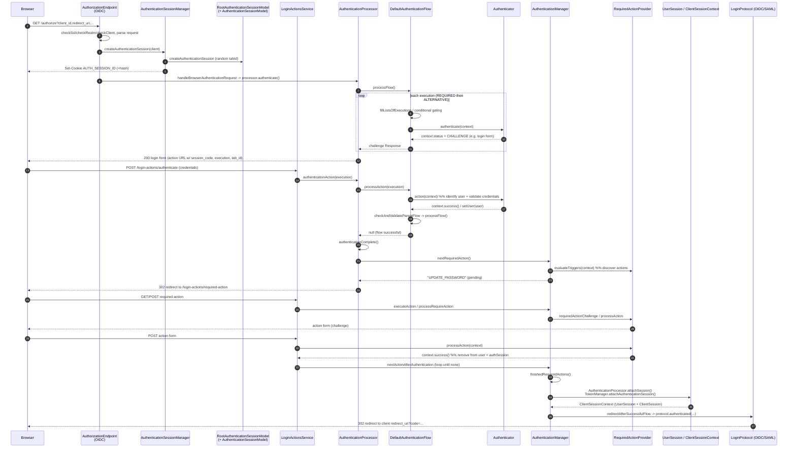
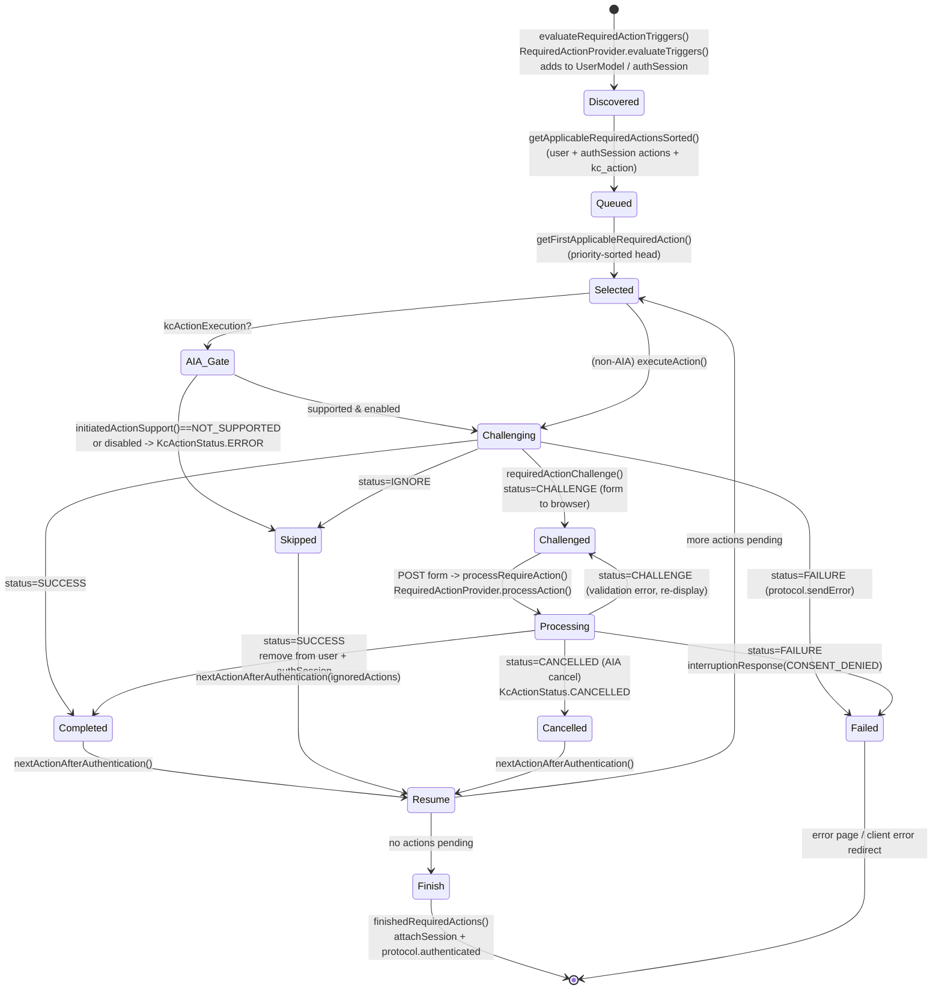
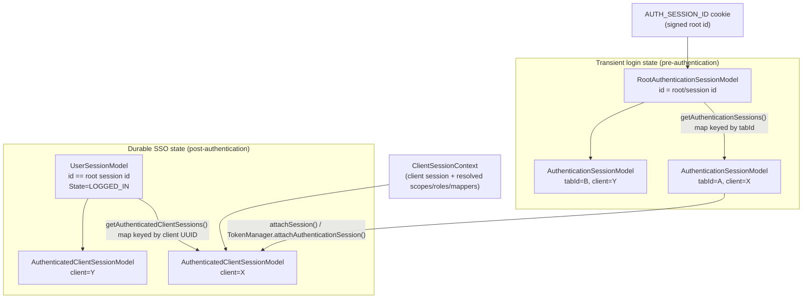

# Code Analysis: Keycloak Browser Authentication Flow and Required-Action Lifecycle

## Final Status

Complete. This is a source-grounded analysis of Keycloak's browser login path and
required-action lifecycle. No product code was changed. All class/method/line references
were taken from the pinned worktree described below and spot-verified by reading the files
directly.

- Worktree: `models/CASSANDRA/05_code_analysis/task_001/workspace/keycloak`
- Branch: `bench/CASSANDRA/05_code_analysis/task_001`
- Base commit: `0526b94f0d` ("Set version to 26.6.0")

All paths below are relative to the worktree root. Line numbers are from the base commit
and may drift slightly if the tree changes.

---

## Executive Summary

A browser OIDC/SAML login enters at a protocol authorization endpoint
(`AuthorizationEndpoint` for OIDC). That endpoint creates a `RootAuthenticationSessionModel`
(bound to the browser via the signed `AUTH_SESSION_ID` cookie) and, under it, a per-tab
`AuthenticationSessionModel` keyed by a random `tabId` plus the client. Control is then handed
to the realm's **browser flow**, executed by `AuthenticationProcessor` +
`DefaultAuthenticationFlow`.

`DefaultAuthenticationFlow.processFlow()` walks the flow's executions, partitioning them into
REQUIRED (which also absorbs CONDITIONAL subflows) and ALTERNATIVE groups, recursing into
subflows, gating CONDITIONAL subflows through `ConditionalAuthenticator.matchCondition`, and
invoking each leaf `Authenticator`. Each authenticator reports a `FlowStatus` back through its
`AuthenticationFlowContext`; the flow maps that to a persisted per-execution `ExecutionStatus`
stored on the auth session, and returns a challenge `Response` (form) to the browser or `null`
to continue. Form submits re-enter through `LoginActionsService` and
`DefaultAuthenticationFlow.processAction()`, which resumes the specific execution and walks the
parent flows back up.

Once the flow is fully successful, `AuthenticationProcessor.authenticationComplete()` computes
`nextRequiredAction()`. **Tokens are never issued while a required action is pending**: the
processor either redirects to the next required action or, only when none remain, calls
`AuthenticationManager.finishedRequiredActions()`. That method promotes the transient
`AuthenticationSessionModel` into a durable `UserSessionModel` + `AuthenticatedClientSessionModel`
(via `AuthenticationProcessor.attachSession` → `TokenManager.attachAuthenticationSession`,
producing a `ClientSessionContext`) and finally calls `protocol.authenticated(...)`, which
redirects back to the client with an authorization code / assertion.

Required actions are discovered from two merged sources — `UserModel.getRequiredActionsStream()`
(persistent) and `AuthenticationSessionModel.getRequiredActions()` (transient) — plus the
`kc_action` application-initiated-action (AIA) parameter. Each is a `RequiredActionProvider`
looked up through a `RequiredActionFactory`. The lifecycle for each action is
challenge → process → {SUCCESS | CHALLENGE | FAILURE | CANCELLED | IGNORE}, driven by
`AuthenticationManager.executeAction()` (initial challenge) and
`LoginActionsService.processRequireAction()` (form submit).

---

## Key Class and Interface Map

### Engine / orchestration

| Type | File | Responsibility |
|---|---|---|
| `AuthenticationProcessor` | `services/.../authentication/AuthenticationProcessor.java:89` | Orchestrates a flow run; holds realm/session/authSession/event; `authenticate()`, `authenticationAction()`, `attachSession()`, `authenticationComplete()`. Its inner `Result` (`:333`) implements `AuthenticationFlowContext`. |
| `AuthenticationFlow` (iface) | `services/.../authentication/AuthenticationFlow.java:29` | Contract: `processFlow()`, `processAction(String)`, `isSuccessful()`. Provider ids `basic-flow`, `form-flow`, `client-flow`. |
| `DefaultAuthenticationFlow` | `services/.../authentication/DefaultAuthenticationFlow.java:243` | The `basic-flow` engine. Requirement evaluation, subflow recursion, conditional gating, per-execution status. |
| `FormAuthenticationFlow` | `services/.../authentication/FormAuthenticationFlow.java` | The `form-flow` (e.g. registration): aggregates `FormAction`s; `isSuccessful()` always `false` (`:325`). |
| `ClientAuthenticationFlow` | `services/.../authentication/ClientAuthenticationFlow.java` | `client-flow` used for client (not browser-user) authentication. |
| `AuthenticationManager` | `services/.../services/managers/AuthenticationManager.java` | Required-action discovery/execution, session finalization, SSO validity, redirects to client. |

### Authenticator extension points

| Type | File | Responsibility |
|---|---|---|
| `Authenticator` (iface) | `server-spi-private/.../authentication/Authenticator.java:36` | `authenticate(ctx)` (`:57`), `action(ctx)` (`:64`), `requiresUser()` (`:72`), `configuredFor(...)` (`:82`), `setRequiredActions(...)` (`:88`). |
| `AuthenticatorFactory` (iface) | `server-spi-private/.../authentication/AuthenticatorFactory.java:32` | Marker composing `ProviderFactory<Authenticator>` + `ConfigurableAuthenticatorFactory` (`getDisplayType`, `getReferenceCategory`, `getRequirementChoices`, `isUserSetupAllowed`). |
| `ConditionalAuthenticator` (iface) | `services/.../authentication/authenticators/conditional/ConditionalAuthenticator.java:26` | `matchCondition(ctx)`; default `authenticate` is a no-op. |
| `AuthenticationFlowContext` (iface) | `server-spi-private/.../authentication/AuthenticationFlowContext.java` | Callback surface authenticators use: `success/challenge/failure/attempted/...`, `form()`, `getUser()`, `getAuthenticationSession()`. |

### Required-action extension points

| Type | File | Responsibility |
|---|---|---|
| `RequiredActionProvider` (iface) | `server-spi-private/.../authentication/RequiredActionProvider.java` | `evaluateTriggers(ctx)` (`:70`), `requiredActionChallenge(ctx)` (`:79`), `processAction(ctx)` (`:86`), `initiatedActionSupport()` (`:46`), `getMaxAuthAge(session)` (`:104`). |
| `RequiredActionFactory` (iface) | `server-spi-private/.../authentication/RequiredActionFactory.java` | `create(session)`/`getId()` (inherited), `getDisplayText()` (`:62`), `isOneTimeAction()` (`:69`). |
| `RequiredActionContext` (iface) | `server-spi-private/.../authentication/RequiredActionContext.java:41` | Callback surface: `challenge/success/failure/cancel/ignore`, `Status` and `KcActionStatus` enums (`:42`, `:50`). |
| `RequiredActionContextResult` | `services/.../authentication/RequiredActionContextResult.java` | Concrete `RequiredActionContext`; resolves per-action config, builds action URL / login form. |

### Session model

| Type | File | Responsibility |
|---|---|---|
| `RootAuthenticationSessionModel` | `server-spi/.../sessions/RootAuthenticationSessionModel.java:37` | Per-browser root; `Map<tabId, AuthenticationSessionModel> getAuthenticationSessions()` (`:64`); `createAuthenticationSession(client)` (`:79`). |
| `AuthenticationSessionModel` | `server-spi/.../sessions/AuthenticationSessionModel.java:32` | Per-tab, per-client transient login state; `getParentSession()` (`:44`), `getTabId()` (`:38`), auth/client/user-session notes, `getExecutionStatus()`, required actions. Extends `CommonClientSessionModel`. |
| `UserSessionModel` | `server-spi/.../models/UserSessionModel.java` | Durable SSO session; `State` enum (`:112`); `getAuthenticatedClientSessions()` (`:85`, keyed by client UUID). |
| `AuthenticatedClientSessionModel` | `server-spi/.../models/AuthenticatedClientSessionModel.java` | Per-client session within a user session; `getUserSession()` (`:79`). |
| `ClientSessionContext` (iface) | `server-spi/.../models/ClientSessionContext.java` | Wraps a client session + resolved scopes/roles/mappers; `getClientSession()` (`:32`), `getScopeString()` (`:59`). |
| `AuthenticationSessionManager` | `services/.../services/managers/AuthenticationSessionManager.java` | Creates/reads/removes root sessions; `AUTH_SESSION_ID` cookie handling. |

---

## Browser Authentication Sequence Diagram



---

## Required-Action Lifecycle State Machine



Enum definitions grounding the state machine:

`RequiredActionContext.Status` (`server-spi-private/.../authentication/RequiredActionContext.java:42`):

```java
enum Status { CHALLENGE, SUCCESS, CANCELLED, IGNORE, FAILURE }
enum KcActionStatus { SUCCESS, CANCELLED, ERROR }
```

Per-execution flow status recorded on the auth session
(`server-spi/.../sessions/CommonClientSessionModel.java:60`):

```java
enum ExecutionStatus { FAILED, SUCCESS, SETUP_REQUIRED, ATTEMPTED, SKIPPED,
                       CHALLENGED, EVALUATED_TRUE, EVALUATED_FALSE }
```

Authenticator-visible status (`server-spi-private/.../authentication/FlowStatus.java:26`):

```java
enum FlowStatus { SUCCESS, CHALLENGE, FORCE_CHALLENGE, FAILURE_CHALLENGE,
                  FAILED, ATTEMPTED, FORK, FLOW_RESET }
```

Auth-session action (`server-spi/.../sessions/CommonClientSessionModel.java:49`):

```java
enum Action { OAUTH_GRANT, AUTHENTICATE, LOGGED_OUT, LOGGING_OUT,
              REQUIRED_ACTIONS, USER_CODE_VERIFICATION }
```

User session state (`server-spi/.../models/UserSessionModel.java:112`):

```java
enum State { LOGGED_IN, LOGGING_OUT, LOGGED_OUT, LOGGED_OUT_UNCONFIRMED }
```

---

## Step-by-Step Execution Path (with Java references)

### 1. Browser login request enters the authentication session

- `AuthorizationEndpoint.buildGet()`/`buildPost()` → `process(params)`
  (`services/.../protocol/oidc/endpoints/AuthorizationEndpoint.java:117,110,134`) performs
  `checkSsl/checkRealm/checkClient`, parses the request, and validates response type and
  redirect URI.
- `AuthorizationEndpoint.java:204` calls
  `createAuthenticationSession(client, request.getState())`, which delegates to
  `AuthorizationEndpointBase.createAuthenticationSession(...)`
  (`services/.../protocol/AuthorizationEndpointBase.java:174`).
  - Existing root session (from cookie) → `rootAuthSession.createAuthenticationSession(client)`
    (`:181`).
  - Existing SSO user session but no root → recreate root under the same id as the user session,
    reset cookies (`:196-204`).
  - Otherwise → `manager.createAuthenticationSession(realm, true)` creates the root and sets the
    browser cookie (`:220-226`).
- The tab id is generated in
  `RootAuthenticationSessionAdapter.createAuthenticationSession(...)`
  (`model/infinispan/.../RootAuthenticationSessionAdapter.java:122`):
  `tabId = Base64Url.encode(randomBytes(8))` (`:127`), stored in the per-root map (`:147`), with
  an `authSessionsLimit` eviction of the oldest tab (`:136-145`).
- `AuthenticationSessionManager.createAuthenticationSession(realm, true)`
  (`:68`) sets `AUTH_SESSION_ID` via `setAuthSessionCookie` (`:108`) and a hash cookie
  (`setAuthSessionIdHashCookie`, `:121`).
- The browser flow is bootstrapped by
  `AuthorizationEndpointBase.handleBrowserAuthenticationRequest(...)`
  (`:107`), which sets the restart cookie (`RestartLoginCookie.setRestartCookie`, `:145`) and
  calls `processor.authenticate()`.

### 2. Browser flow executions run (forms, authenticators, conditionals, subflows)

- `AuthenticationProcessor.authenticate()` (`:954`) → `authenticateOnly()` (`:1105`) →
  `createFlowExecution(flowId, null)` (`:938`) → `DefaultAuthenticationFlow.processFlow()`
  (`:243`).
- `checkClientSession(false)` (`:1089`) validates the client session code / lifespan and bumps
  the parent-session timestamp.
- `fillListsOfExecutions(...)` (`DefaultAuthenticationFlow.java:322`) partitions executions:
  REQUIRED and CONDITIONAL → `requiredList`; ALTERNATIVE → `alternativeList`; DISABLED are
  dropped. If both lists are non-empty, ALTERNATIVE is cleared (REQUIRED wins, `:333-340`).
- Required loop (`:264-285`): each required element is processed via
  `processSingleFlowExecutionModel(required, true)`; a non-null `Response` (a form) short-circuits
  and returns to the browser; a silent failure breaks the loop.
- CONDITIONAL subflows are gated by `isConditionalSubflowDisabled(...)` (`:349`): a conditional
  subflow is disabled if it contains no enabled `ConditionalAuthenticator` or if any contained
  condition fails. `conditionalNotMatched(...)` (`:378`) calls `matchCondition(context)` and
  records `EVALUATED_TRUE`/`EVALUATED_FALSE`.
- Subflows recurse: `processSingleFlowExecutionModel` subflow branch (`:404-421`) calls
  `processor.createFlowExecution(model.getFlowId(), model)` then `processFlow()`, stamping the
  parent execution `SUCCESS`/`FAILED`/`CHALLENGED`.
- Leaf authenticators (`:423-474`): `factory.create(session)` builds the authenticator;
  `requiresUser()` handling can throw `UNKNOWN_USER` / `CREDENTIAL_SETUP_REQUIRED` or record
  `SETUP_REQUIRED`; then `authenticator.authenticate(context)` runs and `processResult(...)`
  (`:508`) maps `FlowStatus` → `ExecutionStatus` and returns a challenge or `null`.

### 3. User identification and credential validation

- The username form is `UsernamePasswordForm` / `AbstractUsernameFormAuthenticator`
  (`services/.../authentication/authenticators/browser/`). On submit, the authenticator's
  `action(context)` sets the user via `context.setUser(user)` →
  `AuthenticationProcessor.setAutheticatedUser(user)` (`:292`), which enforces `USER_CONFLICT`
  if a different user was already set and always calls `validateUser` (`:1225`).
- `validateUser` (`:1225-1232`) rejects disabled users (`USER_DISABLED`) and service-account
  users reaching the browser flow (`UNKNOWN_USER`).
- Form submits re-enter through `LoginActionsService.authenticate()` (GET, `:323`) /
  `authenticateForm()` (POST, `:402`) → `processAuthentication` (`:351`) → `processFlow` (`:355`)
  → `AuthenticationProcessor.authenticationAction(execution)` (`:1052`) →
  `DefaultAuthenticationFlow.processAction(execution)` (`:82`). `processAction` resolves the
  execution, calls `authenticator.action(result)` (`:158`), maps the result, then
  `continueAuthenticationAfterSuccessfulAction` (`:172`) + `checkAndValidateParentFlow` (`:202`)
  walk parent flows back up and re-enter `processFlow`.
- Flow success is `DefaultAuthenticationFlow.isSuccessful()` (`:557`, private `successful`
  set by `onFlowExecutionsSuccessful` `:596`); per-execution success is
  `AuthenticationProcessor.isSuccessful(model)` (`:776`, only `ExecutionStatus.SUCCESS` counts).

### 4. Required actions discovered, queued, challenged, completed, skipped, or failed

- After the flow succeeds, `AuthenticationProcessor.authenticationComplete()` (`:1234`) sets ACR
  (`AcrStore.setAuthFlowLevelAuthenticatedToCurrentRequest`, `:1235`), sets client scopes
  (`:1238`), then computes `nextRequiredAction()` (`:1240`).
- **Discovery:** `AuthenticationManager.evaluateRequiredActionTriggers(...)` (`:1463`) streams
  enabled `RequiredActionProviderModel`s and calls each provider's `evaluateTriggers(context)`
  (a context that throws if the provider tries to challenge/succeed here). Providers add pending
  actions to the `UserModel`, e.g. `UpdatePassword.evaluateTriggers` →
  `context.getUser().addRequiredAction(UPDATE_PASSWORD)`.
- **Queue/order:** `getApplicableRequiredActionsSorted(...)` (`:1405`) unions
  `user.getRequiredActionsStream()` (persistent) and `authSession.getRequiredActions()`
  (transient), filters `ignoredActions`, resolves each to a `RequiredActionProviderModel`, sorts
  by priority, and appends `kc_action` last (or marks it enforced if already present).
- **Challenge:** `executionActions` (`:1305`) → `executeAction(...)` (`:1320`). It builds a
  `RequiredActionContextResult`, applies AIA gating (`initiatedActionSupport()` /
  disabled → `KcActionStatus.ERROR`, `:1339-1349`), then calls
  `actionProvider.requiredActionChallenge(context)` (`:1355`). Dispatch (`:1357-1385`):
  `FAILURE` → `protocol.sendError(CONSENT_DENIED)`; `CHALLENGE` → set
  `CURRENT_AUTHENTICATION_EXECUTION` note and return the form; `IGNORE`/`SUCCESS` → remove from
  user + authSession, set `KcActionStatus`, recurse via `nextActionAfterAuthentication`.
- **Process (form submit):** `LoginActionsService.processRequireAction(...)`
  (`services/.../services/resources/LoginActionsService.java:1152`) verifies the code
  (`verifyRequiredAction`), builds a `RequiredActionContextResult` whose `ignore()` throws inside
  `processAction`, detects AIA cancel (`isCancelAppInitiatedAction`, `:1252`), calls
  `provider.processAction(context)` (`:1204`), and dispatches on status (`:1211-1234`):
  `CANCELLED` → clear execution note + `KcActionStatus.CANCELLED` + loop; `SUCCESS` → remove from
  authSession + user + loop; `CHALLENGE` → re-display; `FAILURE` → `interruptionResponse`
  (`CONSENT_DENIED`).

### 5. Flow resumes after each required action

- Both `executeAction` and `processRequireAction` re-enter
  `AuthenticationManager.nextActionAfterAuthentication(...)` (`:1023`), which calls
  `actionRequired(...)` (`:1182`) — re-evaluating triggers and executing the next applicable
  action — with an accumulating `ignoredActions` set so already-handled or unsupported actions
  are not re-selected. This is the loop that advances the queue until it is empty.
- Between requests, `redirectToRequiredActions(...)` (`:1040`) issues a 302 to a non-action URL,
  sets `CURRENT_FLOW_PATH = REQUIRED_ACTION` and `CURRENT_AUTHENTICATION_EXECUTION`, so a browser
  refresh does not repost a form.

### 6. Auth session becomes an authenticated user/client session and redirects to the client

- When `nextRequiredAction()` returns `null`, `authenticationComplete()` calls
  `AuthenticationManager.finishedRequiredActions(...)` (`:1074`).
- `finishedRequiredActions`:
  1. If `INVALIDATE_ACTION_TOKEN` note present, re-check expiry and mark the token revoked in the
     single-use store (`:1076-1090`).
  2. If `END_AFTER_REQUIRED_ACTIONS` note is set (action-token/account flows), show an info page
     and remove the auth session rather than completing SSO (`:1092-1111`).
  3. Otherwise `AuthenticationProcessor.attachSession(authSession, userSession, ...)` (`:1114`)
     promotes the auth session into a real user/client session.
- `AuthenticationProcessor.attachSession(...)` (`:1146`): looks up or creates a `UserSessionModel`
  whose id equals the root auth session id (`:1155-1162`), sets state `LOGGED_IN` (`:1181`), and
  calls `TokenManager.attachAuthenticationSession(...)`
  (`services/.../protocol/oidc/TokenManager.java:602`) to create/attach the
  `AuthenticatedClientSessionModel`, transfer notes/scopes, and return a
  `ClientSessionContext`. `DIFFERENT_USER_AUTHENTICATED` is thrown if a valid existing user
  session belongs to a different user (`:1175-1178`).
- `redirectAfterSuccessfulFlow(...)` (`:945`) sets user-session state, handles remember-me,
  distinguishes SSO vs fresh auth (`AUTH_TIME`, `SSO_AUTH`), clears brute-force failures, and
  finally returns `protocol.authenticated(authSession, userSession, clientSessionCtx)` (`:988`) —
  the OIDC/SAML redirect back to the client's `redirect_uri` with a code/assertion.

---

## How Custom Authenticators Plug into the Browser Flow

- Implement `Authenticator` (`server-spi-private/.../authentication/Authenticator.java:36`) and an
  `AuthenticatorFactory` (`:32`) registered via a `META-INF/services` file. The factory declares
  `getReferenceCategory()`, `getRequirementChoices()` (REQUIRED/ALTERNATIVE/DISABLED), and
  `isUserSetupAllowed()`.
- The engine instantiates the authenticator in
  `DefaultAuthenticationFlow.createAuthenticator(...)` (`:78`, `factory.create(session)`) and
  invokes `authenticate(context)` on first display and `action(context)` on form submit.
- The authenticator communicates outcome through the `AuthenticationFlowContext` (the
  `AuthenticationProcessor.Result` inner class, `:333`): `success()`, `challenge(Response)`,
  `forceChallenge`, `failureChallenge`, `failure(error)`, `attempted()`, `forkWithSuccessMessage`,
  `resetFlow()`. `context.form()` (`:607`) builds a `LoginFormsProvider` pre-populated with the
  action URL (`getActionUrl`, `:633`) and access code.
- `requiresUser()` and `configuredFor(...)` control whether the authenticator needs a user and
  can trigger `SETUP_REQUIRED` + `setRequiredActions(...)` (`:452-457`).
- **Conditional** authenticators implement `ConditionalAuthenticator.matchCondition(context)`
  (used only to enable/disable a CONDITIONAL subflow). Built-ins under
  `services/.../authenticators/conditional/` include `ConditionalUserConfiguredAuthenticator`,
  `ConditionalRoleAuthenticator`, `ConditionalLoaAuthenticator`,
  `ConditionalUserAttributeValue`, `ConditionalClientScopeAuthenticator`,
  `ConditionalCredentialAuthenticator`, `ConditionalSubFlowExecutedAuthenticator`.

## How Custom Required Actions Plug into the Lifecycle

- Implement `RequiredActionProvider`
  (`server-spi-private/.../authentication/RequiredActionProvider.java`) and a
  `RequiredActionFactory` (registered via `META-INF/services`). `getId()` is the action alias.
- `evaluateTriggers(context)` (`:70`) is called on every authentication and may only add/remove
  actions on the `UserModel` (it must not challenge/succeed — the trigger-time context throws
  otherwise, `AuthenticationManager.java:1485-1510`).
- `requiredActionChallenge(context)` (`:79`) returns the form (`context.challenge(...)` /
  `context.form()`), or `success()` / `failure()` / `ignore()`.
- `processAction(context)` (`:86`) handles the submitted form; `context.success()` removes the
  action from both stores, `context.challenge()` re-displays validation errors,
  `context.failure()` aborts, `context.cancel()` is AIA-only.
- **AIA / `kc_action`:** override `initiatedActionSupport()` to return `SUPPORTED` to allow the
  action to be invoked directly via the `kc_action` request parameter; the parameter is parsed in
  `AuthzEndpointRequestParser` and stored as client notes by `AuthorizationEndpoint`
  (`KC_ACTION`, `KC_ACTION_PARAMETER`). The result is reported to the client via
  `kc_action_status` in `OIDCLoginProtocol.authenticated`.
- Reference implementations under `services/.../authentication/requiredactions/`:
  `UpdatePassword`, `UpdateTotp`, `UpdateEmail`, `UpdateProfile`, `VerifyEmail`,
  `VerifyUserProfile`, `TermsAndConditions`, `DeleteAccount`, `RecoveryAuthnCodesAction`,
  `WebAuthnRegister`, `WebAuthnPasswordlessRegister`.

---

## Session Model Relationships



Key facts, grounded in code:

- A `RootAuthenticationSessionModel` is 1-per-browser (bound to the `AUTH_SESSION_ID` cookie) and
  holds a `Map<tabId, AuthenticationSessionModel>` (`RootAuthenticationSessionModel.java:64`).
  A child is looked up by **both** client and tabId
  (`getAuthenticationSession(client, tabId)`, `:72`).
- An `AuthenticationSessionModel` is transient per-tab, per-client login state
  (`getParentSession()`, `getTabId()`, execution status, notes, required actions).
- On success the auth session is promoted to a `UserSessionModel` **whose id equals the root
  auth session id** (`AuthenticationProcessor.java:1157-1161`), plus an
  `AuthenticatedClientSessionModel` per client (keyed by client UUID,
  `UserSessionModel.java:85`), created/attached by
  `TokenManager.attachAuthenticationSession` (`TokenManager.java:602`).
- `ClientSessionContext` wraps the client session and its resolved scopes/roles/mappers and is the
  object passed into `protocol.authenticated(...)`.
- Auth notes are cleared on flow restart; client notes are preserved across restart
  (`AuthenticationSessionModel.java` note Javadoc). `AuthenticationProcessor.resetFlow` (`:994`)
  clears authenticated user, execution status, user-session notes, auth notes, and required
  actions.

---

## Security-Sensitive Checkpoints (and why they matter)

1. **Required actions gate token issuance.** `authenticationComplete()`
   (`AuthenticationProcessor.java:1234-1247`) only calls `finishedRequiredActions` (which attaches
   the session and calls `protocol.authenticated`) when `nextRequiredAction()` returns `null`.
   This is the core invariant that a user cannot receive tokens while, e.g., `UPDATE_PASSWORD` or
   `VERIFY_EMAIL` is still pending. Actions are removed from both the user and the auth session on
   success so they cannot be skipped or replayed.
2. **User validity is re-checked at multiple points.** `validateUser` (`:1225`) blocks disabled
   and service-account users; `setAutheticatedUser` (`:292`) blocks `USER_CONFLICT`;
   `attachSession` (`:1175-1178`) blocks `DIFFERENT_USER_AUTHENTICATED`; the action-token layer
   `LoginActionsServiceChecks.checkIsUserValid` (`LoginActionsServiceChecks.java:125-154`)
   re-validates existence/enabled and prevents cross-account use in one browser session.
3. **Client-session code and lifespan checks.** `checkClientSession` (`:1089`) and
   `ClientSessionCode.isActionActive` (`ClientSessionCode.java:157-177`) bound the login window;
   `SessionCodeChecks` enforces action validity and page-expired handling.
4. **Signed / hashed auth-session cookie.** The `AUTH_SESSION_ID` cookie is signed and base64
   encoded and its hash cross-checked (`AuthenticationSessionManager.java:108-127`); the manager
   verifies the referenced root session actually exists before trusting it (`:208-211`), and
   `SessionCodeChecks` errors with `INVALID_CODE` if the cookie root and query-param root diverge.
5. **Single-use action tokens.** `finishedRequiredActions` marks
   `INVALIDATE_ACTION_TOKEN` revoked in the single-use store (`AuthenticationManager.java:1076-1090`)
   and `LoginActionsServiceChecks.checkTokenWasNotUsedYet` (`:294-300`) rejects already-used tokens,
   defeating replay of reset-credentials/verify-email links. Reset tokens are strictly single-use
   (`ResetCredentialsActionTokenHandler.canUseTokenRepeatedly()` → `false`).
6. **AIA sanity gating.** `executeAction` refuses to run a `kc_action` whose provider returns
   `NOT_SUPPORTED` or is disabled (`:1339-1349`), and `getMaxAuthAge` /
   `OIDCLoginProtocol.isReAuthRequiredForKcAction` forces re-authentication for sensitive AIAs.
7. **Brute-force integration.** `logFailure` (`:767`) records failures via `BruteForceProtector`;
   `logSuccess` clears them on completion.
8. **`prompt=none` (passive) safety.** A brokered login that would hit a required action under
   `prompt=none` is rejected with `INTERACTION_REQUIRED`
   (`IdentityBrokerService.java:1075-1078`), preventing silent completion that skips a required
   interaction.

---

## Edge-Case Analysis

1. **Expired or missing authentication session.** Detected in `SessionCodeChecks.initialVerify`/
   `initialVerifyAuthSession` (`SessionCodeChecks.java:139,167-176,309-331`). Time-based expiry
   uses `ClientSessionCode.isActionActive` (`ClientSessionCode.java:157-177`) and
   `SessionExpiration.getAuthSessionExpiration` (`SessionExpiration.java:38-40`). Recovery paths:
   `showPageExpired` (`AuthenticationFlowURLHelper.java:55-97`) renders the login-expired page at
   the last execution; `RestartLoginCookie.restartSession` (`RestartLoginCookie.java:145-177`)
   rebuilds a session from the encrypted `KC_RESTART` cookie (only into the same client), and
   `SessionCodeChecks.restartAuthenticationSessionFromCookie` (`:425-476`) wires it up with a
   `LOGIN_TIMEOUT` message. **Confirmed.**

2. **Required action cancelled or failed.** `LoginActionsService.processRequireAction`
   (`:1211-1234`): `CANCELLED` fires `REJECTED_BY_USER`, clears the execution note, sets
   `KcActionStatus.CANCELLED`, and loops back (does NOT complete login); `FAILURE` →
   `interruptionResponse(CONSENT_DENIED)` aborts to the client. Note `CANCELLED` is handled only
   at process time, not at challenge time (`executeAction` handles `FAILURE`/`IGNORE`/`SUCCESS`).
   **Confirmed.**

3. **Duplicate browser tabs sharing an auth session.** Each tab gets its own random `tabId`
   under one root/cookie (`RootAuthenticationSessionAdapter.java:122-160`); lookup is by
   `(client, tabId)` (`AuthenticationSessionManager.java:92-103`). A per-root `authSessionsLimit`
   silently evicts the oldest tab. Cookie-vs-query root divergence → `INVALID_CODE`
   (`SessionCodeChecks.java:167-176`). Action-token forks are reconciled via the `FORKED_FROM`
   note (`LoginActionsServiceChecks.java:259-292`). **Confirmed at the model level.** *Inference:*
   there is no explicit same-tab concurrency lock in the code inspected; true concurrent-write
   behavior depends on the Infinispan `SessionEntityUpdater` merge semantics, which were not
   opened. Confirming that would require reading the cache update-task implementation.

4. **User missing / disabled / changed during the flow.** `setAutheticatedUser` →
   `USER_CONFLICT` (`:292-295`); `validateUser` → `USER_DISABLED` / `UNKNOWN_USER` (`:1225-1232`);
   `attachSession` → `DIFFERENT_USER_AUTHENTICATED` (`:1175-1178`); SSO validity via
   `AuthenticationManager.isSessionValid` (`:191-217`); action-token layer
   `checkIsUserValid` (`LoginActionsServiceChecks.java:125-154`). **Confirmed.**

5. **Brokered identity login leading into required actions.** `IdentityBrokerService`
   (`:773-803`, `:1053-1079`) sets `BROKER_SESSION_ID`/`BROKER_USER_ID` auth notes, runs the
   first-broker-login flow, and computes `nextRequiredAction`. Broker authenticators add required
   actions/enforce profile update: `IdpCreateUserIfUniqueAuthenticator` (`:57-112`, may add
   `UPDATE_PASSWORD`), `IdpReviewProfileAuthenticator` (`ENFORCE_UPDATE_PROFILE`),
   `AbstractIdpAuthenticator.getExistingUser` (`:111-130`). The broker notes flow into the user
   session in `AuthenticationProcessor.attachSession` (`:1152-1162`). **Confirmed.**

6. **Reset-credentials / action-token paths overlapping with required actions.**
   `LoginActionsService.resetCredentialsPOST/GET` (`:415-465`), `executeActionToken`/
   `handleActionToken` (`:546-723`), and `AbstractActionTokenHandler.startFreshAuthenticationSession`
   (`:97-102`, sets `END_AFTER_REQUIRED_ACTIONS=true`). These feed into the standard required-actions
   pipeline via a handler-specific `authenticationComplete()`; `finishedRequiredActions` shows an
   info page and removes the session instead of issuing SSO tokens when `END_AFTER_REQUIRED_ACTIONS`
   is set (`AuthenticationManager.java:1092-1111`). Reset-credentials in a broker context redirects
   back to the after-broker endpoint (`ResetCredentialsActionTokenHandler.java:84-109`).
   **Confirmed.**

7. **Stale, replayed, or invalid action links/tokens.** `finishedRequiredActions` re-checks
   expiry and revokes via the single-use store (`AuthenticationManager.java:1076-1090`);
   `checkTokenWasNotUsedYet` rejects revoked tokens (`LoginActionsServiceChecks.java:294-300`);
   `handleActionToken` enforces `TokenVerifier.IS_ACTIVE` and reconciles/restarts on
   `TokenNotActiveException` (`LoginActionsService.java:618-648,703-706`). **Confirmed.**
   *Inference:* the exact TTL / persistence guarantee of the revoked marker lives in the
   `SingleUseObjectProvider` implementation, which was not opened; reading it would confirm the
   precise replay window.

8. **Required actions must not be bypassable before token issuance.** As under Security
   Checkpoint 1: `authenticationComplete()` (`AuthenticationProcessor.java:1234-1247`) calls
   `finishedRequiredActions` (the only path that attaches the session and calls
   `protocol.authenticated`) exclusively when `nextRequiredAction()` returns `null`
   (`AuthenticationManager.java:1074-1122,1125-1158`). **Confirmed.**

---

## Files Inspected

- `services/.../authentication/AuthenticationProcessor.java`
- `services/.../authentication/DefaultAuthenticationFlow.java`
- `services/.../authentication/FormAuthenticationFlow.java`
- `services/.../authentication/AuthenticationFlow.java`
- `services/.../authentication/RequiredActionContextResult.java`
- `services/.../authentication/authenticators/conditional/ConditionalAuthenticator.java` (+ implementations)
- `services/.../authentication/authenticators/broker/` (IdpCreateUserIfUniqueAuthenticator, IdpReviewProfileAuthenticator, AbstractIdpAuthenticator)
- `services/.../authentication/requiredactions/` (UpdatePassword, TermsAndConditions, etc.)
- `services/.../authentication/actiontoken/` (AbstractActionTokenHandler, ResetCredentialsActionTokenHandler)
- `services/.../services/managers/AuthenticationManager.java`
- `services/.../services/managers/AuthenticationSessionManager.java`
- `services/.../services/managers/ClientSessionCode.java`
- `services/.../services/resources/LoginActionsService.java`
- `services/.../services/resources/SessionCodeChecks.java`
- `services/.../services/resources/LoginActionsServiceChecks.java`
- `services/.../services/resources/IdentityBrokerService.java`
- `services/.../services/util/AuthenticationFlowURLHelper.java`
- `services/.../protocol/AuthorizationEndpointBase.java`
- `services/.../protocol/oidc/endpoints/AuthorizationEndpoint.java`
- `services/.../protocol/oidc/TokenManager.java`
- `services/.../protocol/RestartLoginCookie.java`
- `server-spi/.../sessions/RootAuthenticationSessionModel.java`
- `server-spi/.../sessions/AuthenticationSessionModel.java`
- `server-spi/.../sessions/CommonClientSessionModel.java`
- `server-spi/.../models/UserSessionModel.java`
- `server-spi/.../models/ClientSessionContext.java`
- `server-spi/.../models/AuthenticatedClientSessionModel.java`
- `server-spi-private/.../authentication/Authenticator.java`
- `server-spi-private/.../authentication/AuthenticatorFactory.java`
- `server-spi-private/.../authentication/ConfigurableAuthenticatorFactory.java`
- `server-spi-private/.../authentication/RequiredActionProvider.java`
- `server-spi-private/.../authentication/RequiredActionFactory.java`
- `server-spi-private/.../authentication/RequiredActionContext.java`
- `server-spi-private/.../authentication/FlowStatus.java`
- `server-spi-private/.../models/utils/SessionExpiration.java`
- `model/infinispan/.../RootAuthenticationSessionAdapter.java`

---

## Commands Run

- `git worktree add -b bench/CASSANDRA/05_code_analysis/task_001 <workspace>/keycloak 0526b94f0d`
  — created the pinned worktree (the task's `workspace/keycloak` directory was empty except for a
  `.gitkeep`; the base commit was obtained from the sibling `02_bug_fix` worktree's
  `git worktree list`).
- `git log --oneline`, `git branch`, `git worktree list` — verify base commit and branch.
- `find` / glob / grep across `services`, `server-spi`, `server-spi-private`, `model/infinispan`
  to locate classes.
- File reads of the classes listed above (no builds or tests were required for this analysis).

No source files were modified. No temporary experiment files were created.

---

## Limitations / Uncertain Areas

- **Worktree setup.** The task's `workspace/keycloak` directory was empty on arrival. I created
  the required worktree from the benchmark's pinned base commit `0526b94f0d` (the same commit used
  by the sibling task worktrees) on branch `bench/CASSANDRA/05_code_analysis/task_001`. If the
  intended base differs, line numbers should be re-verified.
- **Line numbers** are from the base commit and are precise for the files I read directly; a few
  were sourced from sub-agent exploration and cross-checked on the most important paths
  (`AuthenticationProcessor`, `AuthenticationManager.executeAction`, `RequiredActionContext`) but
  not every single cited line was independently re-opened.
- **Concurrency semantics** for duplicate tabs (Edge Case 3) and the exact TTL/persistence of the
  single-use revoked-token marker (Edge Case 7) live in the Infinispan `SessionEntityUpdater` /
  `SingleUseObjectProvider` implementations, which were not opened. Those are labeled as
  inferences above.
- **SAML path** was analyzed only at the abstraction level: the browser flow, required actions,
  and `protocol.authenticated(...)` contract are protocol-agnostic, but I focused concrete
  endpoint tracing on OIDC (`AuthorizationEndpoint`). SAML uses its own `SamlService`/endpoint but
  reuses the same `AuthenticationProcessor` machinery.
- **FormAuthenticationFlow** (registration) and `ClientAuthenticationFlow` were surveyed but are
  not the primary focus of a browser *login*; details on `FormAction` validation were summarized
  rather than exhaustively traced.

---

## Token Usage and Estimated Cost

Token counts and cost below are from `session.json`.

| Metric | Value |
|---|---:|
| input_tokens | 50 |
| output_tokens | 29602 |
| reasoning_tokens | 0 |
| cache_write_tokens | 114562 |
| cache_hit_tokens | 1005271 |
| total_tokens | 1149485 |
| estimated_cost_usd | 1.95894800 |

Pricing from `models/CASSANDRA/model.yaml`: input $5.00 / 1M, output $25.00 / 1M,
cache-write $6.25 / 1M, cache-hit $0.50 / 1M.
