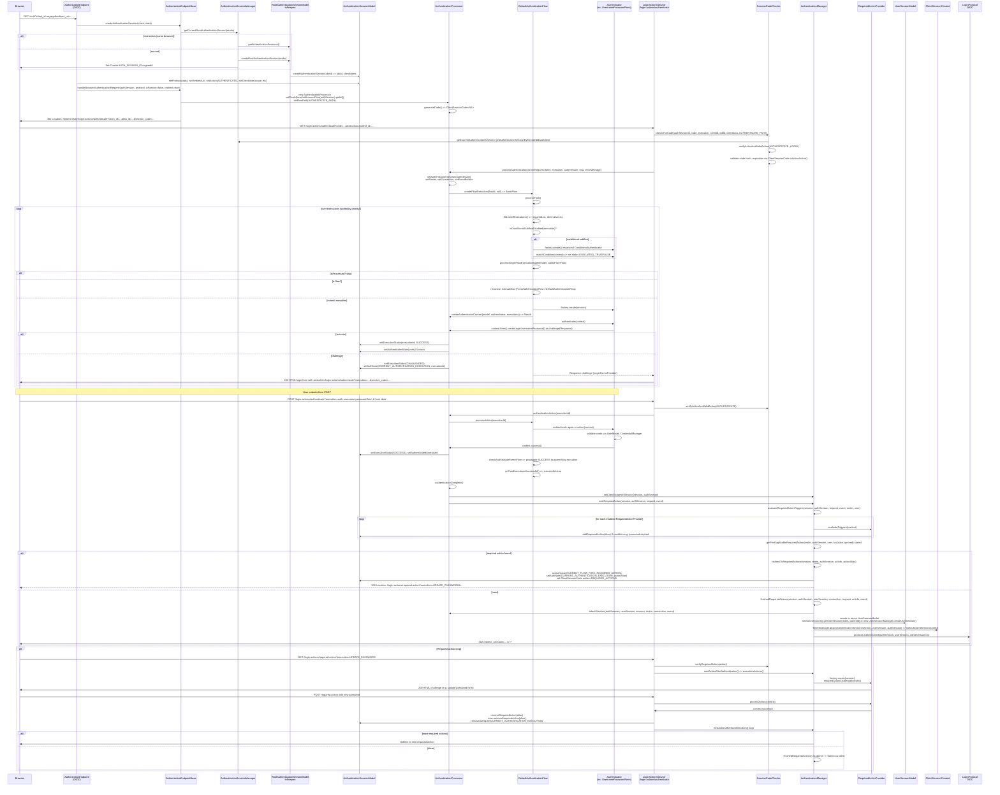
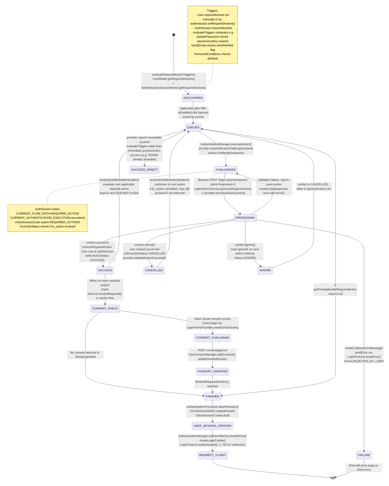

# Code Analysis Task 001: Browser Authentication Flow and Required Actions - Report

## Status
completed

## Executive Summary
Keycloak's browser login is a stateful, cookie-anchored flow centered on `RootAuthenticationSessionModel` (one per browser) and `AuthenticationSessionModel` (one per tab/client). Entry starts at OIDC `AuthorizationEndpoint` (`/auth/realms/{realm}/protocol/openid-connect/auth`) which creates or reuses a root session via `AuthenticationSessionManager`, then delegates to `AuthorizationEndpointBase.handleBrowserAuthenticationRequest()`. That builds an `AuthenticationProcessor` which resolves the browser flow (`AuthenticationFlowResolver.resolveBrowserFlow`) and executes it via `DefaultAuthenticationFlow`. `DefaultAuthenticationFlow.processFlow()` iterates over `AuthenticationExecutionModel`s, separating REQUIRED and ALTERNATIVE, handling conditional subflows (`ConditionalAuthenticator.matchCondition`) and invoking each `Authenticator.authenticate()` through `AuthenticationProcessor.Result` context. Success marks execution status in `AuthenticationSessionModel.getExecutionStatus()`, challenge returns a `Response` rendered by `LoginFormsProvider`.

After all executions succeed, `AuthenticationProcessor.authenticationComplete()` -> `AuthenticationManager.nextRequiredAction()` evaluates `RequiredActionProvider.evaluateTriggers()` for all enabled required actions, plus user/session required actions. The first applicable action (sorted by `RequiredActionProviderModel.RequiredActionComparator`) is challenged via `AuthenticationManager.executionActions()` -> `RequiredActionProvider.requiredActionChallenge()`. The user is redirected (302) to `login-actions/required-action?execution={providerId}` (`AuthenticationManager.redirectToRequiredActions()`). Posting the form hits `LoginActionsService.processRequireAction()` -> `RequiredActionProvider.processAction()`, which sets `RequiredActionContext.Status` SUCCESS|CHALLENGE|FAILURE|CANCELLED|IGNORE. On SUCCESS the action is removed from `UserModel` and `AuthenticationSessionModel`, then `nextActionAfterAuthentication()` loops to next required action. When no required action remains, `AuthenticationManager.finishedRequiredActions()` attaches the session (`AuthenticationProcessor.attachSession()` creates `UserSessionModel` via `UserSessionManager`, and `ClientSessionContext` via `TokenManager.attachAuthenticationSession`), creates login cookie (`AuthenticationManager.createLoginCookie`), and finally `LoginProtocol.authenticated()` redirects back to client with code/tokens.

Custom authenticators and required actions are SPI-discovered via `AuthenticatorFactory` / `RequiredActionFactory` (`META-INF/services/...`), instantiate per-request via `KeycloakSession.getProvider()` or `create()`.

## Key Class and Interface Map

| Class / Interface | Package / Location | Responsibility |
|---|---|---|
| `AuthenticationSessionModel` | `server-spi/.../sessions/AuthenticationSessionModel` | Per-tab state: `tabId`, execution statuses (`ExecutionStatus`), `authenticatedUser`, required actions set, auth notes, client notes, userSession notes, clientScopes. Interface with `setExecutionStatus()`, `setAuthenticatedUser()`, `addRequiredAction()`. |
| `RootAuthenticationSessionModel` | `server-spi/.../sessions/RootAuthenticationSessionModel` | Per-browser container: holds `Map<tabId, AuthenticationSessionModel>`, timestamp for expiration, realm. `createAuthenticationSession(ClientModel)`, `getAuthenticationSession(client, tabId)`, `removeAuthenticationSessionByTabId()`. |
| `UserSessionModel` | `server-spi/.../models/UserSessionModel` | Persistent login session: user, loginUsername, IP, authMethod, brokerSessionId, notes, `AuthenticatedClientSessionModel` map, State LOGGED_IN/LOGGING_OUT. `restartSession()`, `getAuthenticatedClientSessions()`. |
| `AuthenticatedClientSessionModel` | `server-spi/.../models/AuthenticatedClientSessionModel` | Client-bound view of user session, holds protocol, redirectUri, notes, roles. Created by `UserSessionProvider.createClientSession`. |
| `ClientSessionContext` | `server-spi/.../models/ClientSessionContext` | Request-scoped aggregation: `getClientSession()`, `getClientScopesStream()`, `getRolesStream()`, `getProtocolMappersStream()`, `getScopeString()`. Implementation `DefaultClientSessionContext` (`services/.../util/DefaultClientSessionContext`). Built by `TokenManager.attachAuthenticationSession()`. |
| `AuthenticationProcessor` | `services/.../authentication/AuthenticationProcessor` | Core orchestrator. Holds realm, authSession, userSession, connection, uriInfo, eventBuilder. `authenticate():Response`, `authenticateOnly():Response`, `authenticationAction(execution):Response`, `attachSession()`, `nextRequiredAction()`, `generateCode()`. Inner `Result implements AuthenticationFlowContext` provides `success()`, `challenge()`, `failure()`, `form()`, `getActionUrl()`, `fork()`, `resetFlow()`. |
| `DefaultAuthenticationFlow` | `services/.../authentication/DefaultAuthenticationFlow` | Implements `AuthenticationFlow`. Iterates executions. `processFlow():Response` splits required/alternative, handles conditional subflow disabled check `isConditionalSubflowDisabled()`, `processSingleFlowExecutionModel()`, `processResult()`, `fillListsOfExecutions()`. Manages `SUCCESS`, `CHALLENGED`, `FAILED`, `ATTEMPTED`, `SETUP_REQUIRED`. |
| `FormAuthenticationFlow` / `ClientAuthenticationFlow` | same package | Variant flows for form provider type and client authentication; similar delegation to authenticators. |
| `AuthenticationFlowContext` | `server-spi-private/.../authentication/AuthenticationFlowContext` | Context passed to authenticators: `getUser()`, `setUser()`, `getExecution()`, `getAuthenticatorConfig()`, `form()`, `challenge()`, `success()`, `failure()`, `attempted()`, `fork()`, `getAuthenticationSession()`. |
| `Authenticator` | `server-spi-private/.../authentication/Authenticator` | SPI: `authenticate(AuthenticationFlowContext)`, `action(AuthenticationFlowContext)`, `requiresUser()`, `configuredFor()`, `setRequiredActions()`, `getRequiredActions()`. |
| `AuthenticatorFactory` | `server-spi-private/.../authentication/AuthenticatorFactory` | Factory + `ProviderFactory<Authenticator>`, extends `ConfigurableAuthenticatorFactory`. Provides `create()`, `getId()`, `isUserSetupAllowed()`, `getReferenceCategory()`. |
| `ConditionalAuthenticator` | `services/.../authenticators/conditional/ConditionalAuthenticator` | Extends `Authenticator`, adds `matchCondition(AuthenticationFlowContext):boolean`. `authenticate()` defaults no-op. Used to conditionally disable subflows via `EVALUATED_TRUE/FALSE` status. |
| `RequiredActionProvider` | `server-spi-private/.../authentication/RequiredActionProvider` | `evaluateTriggers(RequiredActionContext)`, `requiredActionChallenge(RequiredActionContext)`, `processAction(RequiredActionContext)`, `initiatedActionSupport()`, `initiatedActionCanceled()`, `getMaxAuthAge()`. |
| `RequiredActionFactory` | `server-spi-private/.../authentication/RequiredActionFactory` | `ProviderFactory<RequiredActionProvider>`, `getDisplayText()`, `isOneTimeAction()`, `isConfigurable()`, `getConfigMetadata()`, `validateConfig()`. |
| `RequiredActionContext` | `server-spi-private/.../authentication/RequiredActionContext` | Challenge handling: `Status` CHALLENGE/SUCCESS/CANCELLED/IGNORE/FAILURE, `KcActionStatus`, `challenge()`, `success()`, `failure()`, `cancel()`, `ignore()`, `form()`, `getActionUrl()`, `generateCode()`. |
| `RequiredActionContextResult` | `services/.../authentication/RequiredActionContextResult` | Concrete implementation of `RequiredActionContext`. Holds authSession, realm, eventBuilder, session, user, factory, status, challenge. `form()` builds `LoginFormsProvider` with action URL including `session_code`. |
| `LoginActionsService` | `services/.../resources/LoginActionsService` | JAX-RS resource `/realms/{realm}/login-actions`. Routes: `authenticate` GET/POST, `required-action` GET/POST (`requiredActionGET/POST -> processRequireAction`), `registration`, `reset-credentials`, `first-broker-login`, `post-broker-login`, `action-token`, `consent`. `processFlow()` builds processor and calls `processor.authenticate()` or `processor.authenticationAction()`. Wraps response via `BrowserHistoryHelper`. |
| `SessionCodeChecks` | `services/.../resources/SessionCodeChecks` | Validates `session_code` / authSession existence, SSL, realm enabled, client equality, `client_data` decoding, cookie vs query mismatch, expired code, already-logged-in detection. Methods `initialVerify()`, `initialVerifyAuthSession()`, `verifyActiveAndValidAction()`, `verifyRequiredAction()`. |
| `AuthenticationSessionManager` | `services/.../managers/AuthenticationSessionManager` | Cookie handling and root session lifecycle. `createAuthenticationSession(realm, browserCookie)`, `getCurrentRootAuthenticationSession()`, `getCurrentAuthenticationSession()`, `getAuthenticationSessionByEncodedIdAndClient()`, `setAuthSessionCookie()`, `signAndEncodeToBase64AuthSessionId()`, `removeAuthenticationSession()`, `removeTabIdInAuthenticationSession()`. Validates signature of `AUTH_SESSION_ID`. |
| `ClientSessionCode` | `services/.../managers/ClientSessionCode` | Generates/verifies `session_code` hash tied to authSession. `getOrGenerateCode()`, `isValidAction()`, `isActionActive()`, `parseResult()`. Action types LOGIN, USER. |
| `AuthenticationManager` | `services/.../managers/AuthenticationManager` | Static helpers for required-action loop: `evaluateRequiredActionTriggers()`, `nextRequiredAction()`, `executionActions()`, `executeAction()`, `redirectToRequiredActions()`, `nextActionAfterAuthentication()`, `finishedRequiredActions()`, `redirectAfterSuccessfulFlow()`, `attachSession()`. Also token verification, cookie creation `createLoginCookie()`, `authenticateIdentityCookie()`, brute force logging via `logSuccess/Failed`. |
| `AuthorizationEndpointBase` | `services/.../protocol/AuthorizationEndpointBase` | Base for OIDC/SAML authorization. `createAuthenticationSession()` checks existing root session cookie, reuses or creates new root via `AuthenticationSessionManager`; if userSession exists from identity cookie, reuses its ID for root session. `handleBrowserAuthenticationRequest()` creates processor and calls `processor.authenticateOnly()` for passive, else `processor.authenticate()`. |
| `AuthorizationEndpoint` | `services/.../protocol/oidc/endpoints/AuthorizationEndpoint` | OIDC `/auth` endpoint. `process()` parses params, checks realm/client/redirect/PAR/DPoP/claims/acr, creates authSession via `createAuthenticationSession()`, calls `updateAuthenticationSession()` to store protocol, redirectUri, response_type, scope, prompt, claims into client notes. Then `buildAuthorizationCodeAuthorizationResponse()` -> `handleBrowserAuthenticationRequest()` from base. |
| `LoginProtocol` | `server-spi-private/.../protocol/LoginProtocol` | Protocol abstraction: `authenticated(authSession, userSession, clientSessionCtx):Response`, `sendError()`, `getClientData()`. OIDC impl builds redirect URI with code/id_token via `OIDCRedirectUriBuilder`. |
| `BrowserHistoryHelper` | `services/.../util/BrowserHistoryHelper` | Prevents duplicate form submission via back button, saves response history in authSession notes. Called in `LoginActionsService.processFlow()` and `processRequireAction()` via `saveResponseAndRedirect()`. |
| `AuthenticationFlowModel` / `AuthenticationExecutionModel` | `server-spi/.../models/` | Persistent flow definitions: flow alias, providerId BASIC_FLOW/FORM_FLOW/CLIENT_FLOW, executions with requirement REQUIRED/ALTERNATIVE/CONDITIONAL/DISABLED, authenticatorId, flowId, priority. |
| `DefaultRequiredActions` | `server-spi-private/.../models/utils/DefaultRequiredActions` | Enum of built-in required actions like UPDATE_PASSWORD, VERIFY_EMAIL, CONFIGURE_TOTP etc mapped to providers. |
| `AcrStore`, `AuthenticatorUtil`, `AuthenticationFlowResolver` | `services/.../authentication/` helpers | Acr/LoA tracking, callback IDs tracking (`FORKED_FROM`, `CURRENT_AUTHENTICATION_EXECUTION`, `CURRENT_FLOW_PATH`), resolving top-level browser flow from realm. |

## Browser Authentication Sequence Diagram



## Required Action State Machine



## Execution Path (Concrete Class / Method References)

**1. Browser login request entering authentication session:**

1. `org.keycloak.protocol.oidc.endpoints.AuthorizationEndpoint.buildGet()` line ~118 processes GET request, parses clientId via `AuthorizationEndpointRequestParserProcessor.getClientId()`.
2. Checks realm/client existence `checkClient()`, redirect URI via `AuthorizationEndpointChecker.checkRedirectUri()`, response_type via `checkResponseType()`.
3. `createAuthenticationSession(client, requestState)` in `AuthorizationEndpointBase` line 174:
   - `AuthenticationSessionManager.getCurrentRootAuthenticationSession(realm)` reads `AUTH_SESSION_ID` cookie (`CookieType.AUTH_SESSION_ID`), decodes via `routeEncoder.decodeSessionIdAndRoute`, validates signature via `decodeBase64AndValidateSignature()` + `validateAuthSessionIdSignature()`.
   - If existing root found, `rootAuthSession.createAuthenticationSession(client)` creates new tab with random `tabId`.
   - If none, attempts `manager.getUserSessionFromAuthenticationCookie()` (identity cookie). If userSession exists but user disabled, creates fresh and logs out old session `AuthenticationManager.backchannelLogout()`.
   - Else `createNewAuthenticationSession()` -> `manager.createAuthenticationSession(realm, true)` -> `session.authenticationSessions().createRootAuthenticationSession(realm)` sets cookies via `setAuthSessionCookie()` and `setAuthSessionIdHashCookie()`.
4. `session.getContext().setAuthenticationSession(authSession)` and `LoginFormsProvider.setAuthenticationSession`.
5. `updateAuthenticationSession()` line 335 in AuthorizationEndpoint stores protocol, redirectUri, response_type, scope, additional params, acr/loa into `authSession.setClientNote()`.
6. `handleBrowserAuthenticationRequest(authSession, protocol, isPassive, redirectToAuthentication)` line 107:
   - `getAuthenticationFlow(authSession)` -> `AuthenticationFlowResolver.resolveBrowserFlow(authSession)` resolves browser flow from realm's `getBrowserFlow()` or client override.
   - `createProcessor()` line 80 builds `AuthenticationProcessor` with flowId, flowPath `AUTHENTICATE_PATH`.
   - If passive, calls `processor.authenticateOnly()`; if challenge, may forward passive login or send `Error.PASSIVE_LOGIN_REQUIRED` via `protocol.sendError()`.
   - Else `processor.authenticate()` for normal login, wrapped in try/catch to `processor.handleBrowserException()`.

**2. Browser flow executions running:**

1. `AuthenticationProcessor.authenticate()` line 954:
   - `authenticateOnly()` line 1105 calls `checkClientSession(false)` => creates `ClientSessionCode`, checks `isActionActive(LOGIN)`, timestamp update `parentSession.setTimestamp(Time.currentTime())`, validates user via `validateUser()`.
   - `createFlowExecution(flowId, execution)` line 938 looks up `AuthenticationFlowModel` by id, branches on providerId: `BASIC_FLOW` -> `DefaultAuthenticationFlow`, `FORM_FLOW` -> `FormAuthenticationFlow`, `CLIENT_FLOW` -> `ClientAuthenticationFlow`.
   - Calls `authenticationFlow.processFlow()`.

2. `DefaultAuthenticationFlow.processFlow()` line 244:
   - Checks `AUTHENTICATION_SELECTOR_SCREEN_DISPLAYED` note for "try another way" refresh.
   - `fillListsOfExecutions(executions.stream(), requiredList, alternativeList)` line 322 filters out conditional authenticators (instances of `ConditionalAuthenticator`) and splits by requirement REQUIRED/CONDITIONAL vs ALTERNATIVE, warns if both present.
   - Required loop lines 267-284: For each required, checks `isConditionalSubflowDisabled(required)` line 349: if model is flow, conditional, not yet processed, evaluates child conditional authenticators via `conditionalNotMatched()` line 378 -> creates authenticator, calls `matchCondition(context)`, stores status `EVALUATED_TRUE/FALSE`. If disabled, remove from list.
   - Calls `processSingleFlowExecutionModel(required, true)` line 397:
     - If `isProcessed(model)` line 65 checks execution status SUCCESS/SKIPPED/ATTEMPTED/SETUP_REQUIRED.
     - If flow: recursively creates flow execution via `processor.createFlowExecution(model.getFlowId(), model)` and `authenticationFlow.processFlow()`. On challenge sets status CHALLENGED; on success sets SUCCESS.
     - If normal execution: resolves factory via `getAuthenticatorFactory()` line 371 (lookup `KeycloakSessionFactory.getProviderFactory(Authenticator.class, authenticatorId)`).
     - `createAuthenticator(factory)` -> `factory.create(session)`.
     - Creates selection list for alternative display via `createAuthenticationSelectionList()` -> `AuthenticationSelectionResolver.createAuthenticationSelectionList()`.
     - If requiresUser and no user set, throws `UNKNOWN_USER`.
     - If `configuredFor(session, realm, authUser)` false and `factory.isUserSetupAllowed()` && required && `areRequiredActionsEnabled()` => sets status SETUP_REQUIRED and calls `authenticator.setRequiredActions()`.
     - Else `authenticator.authenticate(context)` line 472 where context is `AuthenticationProcessor.Result`.
   - `processResult(result, false)` line 508 handles FlowStatus: SUCCESS sets status SUCCESS + `AuthenticatorUtils.updateCompletedExecutions()`, FAILED logs via `processor.logFailure()`, sets FAILED, maybe returns challenge or throws `AuthenticationFlowException`, FORK sets note `CURRENT_AUTHENTICATION_EXECUTION` and throws `ForkFlowException`, CHALLENGE/FORCE_CHALLENGE/FAILURE_CHALLENGE sets CHALLENGED and returns `sendChallenge()`.
   - On CHALLENGE path, `Result` also stores `CURRENT_AUTHENTICATION_EXECUTION` note and challenge response which bubbles up to `LoginActionsService.processFlow()` -> saved via `BrowserHistoryHelper.saveResponseAndRedirect()`.

3. Handling action POST:
   - Browser posts to `/login-actions/authenticate?execution=xxx&session_code=yyy` handled by `LoginActionsService.authenticate()` line 323 -> `SessionCodeChecks` validates.
   - `processAuthentication(actionRequest=true, execution, authSession, flow, errorMessage)` line 351 calls `processor.authenticationAction(execution)` line 1052:
     - `checkClientSession(true)` validates action is AUTHENTICATE and code not expired.
     - Compares current execution note `CURRENT_AUTHENTICATION_EXECUTION` vs requested execution to detect refresh -> shows `showPageExpired()` if mismatch.
     - Validates user, looks up execution model, event details.
     - Creates flow execution and calls `authenticationFlow.processAction(execution)` line 83 in DefaultAuthenticationFlow:
       - Validates execution exists, handles "tryAnotherWay" via POST param.
       - If `authExecId` switch attempts, validates against allowed selection list via `createAuthenticationSelectionList()` and re-processes that execution.
       - If execution is flow, delegates to subflow `processAction`.
       - Else creates authenticator factory/context and calls `authenticator.action(result)` line 155, then `processResult(result, true)`. If no challenge, calls `continueAuthenticationAfterSuccessfulAction(model)` line 164 which removes current execution note, validates parent flow recursively via `checkAndValidateParentFlow()` line 202, then re-enters `processFlow()` from parent until top flow completes.

**3. User identification and credential validation:**

- `AbstractUsernameFormAuthenticator` (`services/.../browser/`) extracts username from form, looks up via `session.users().getUserByRealm()` and sets authenticated user via `context.setUser(user)` -> `AuthenticationProcessor.setAutheticatedUser()` line 292 validates previous user conflict (throws USER_CONFLICT if different user) and `validateUser()` checks disabled, serviceAccount.
- Password validation in `PasswordForm.authenticate()` (not shown but typical) checks `action()` verifies credential via `session.userCredentialManager().isValid(realm, user, ...)`. On success calls `context.success()`; on failure `context.failureChallenge()`.
- OTP, WebAuthn, Cookie, Spnego authenticators follow same contract.

**4. Required actions discovery, queuing, challenging, completing:**

- `AuthenticationProcessor.authenticationComplete()` line 1234:
  - `AcrStore.setAuthFlowLevelAuthenticatedToCurrentRequest()`
  - `AuthenticationManager.setClientScopesInSession()` aggregates requested scopes via `TokenManager.getRequestedClientScopes()` storing in `authSession.setClientScopes()`
  - `nextRequiredAction()` line 1249 -> delegates to `AuthenticationManager.nextRequiredAction()` line 1124.

- `AuthenticationManager.nextRequiredAction()`:
  - `evaluateRequiredActionTriggers(session, authSession, request, event, realm, user, new HashSet<>())` line 1469 iterates `realm.getRequiredActionProvidersStream()` filtered enabled & not ignored, maps to factory via `toRequiredActionFactory()`, then `evaluateRequiredAction()` line 1481 creates provider and `RequiredActionContextResult` with overridden methods throwing if challenge/failure called (only evaluateTriggers allowed). Calls `provider.evaluateTriggers(result)`. Example implementations: `UpdatePassword.evaluateTriggers()` checks password policy expiration via `session.users().getUserById` ? Actually checks credential expiration; `VerifyEmail.evaluateTriggers()` checks `user.getEmailVerified()`.
  - `getFirstApplicableRequiredAction()` line 1388 collects `user.getRequiredActionsStream()` + `authSession.getRequiredActions()`, maps each alias to model via `realm.getRequiredActionProviderByAlias()`, filters enabled and not ignored, sorts via `RequiredActionProviderModel.RequiredActionComparator` (priority based on config).
  - Handles `kc_action` client note `Constants.KC_ACTION` for App-Initiated Actions (AIA): if `kcActionAlias` provided, looks up model, flags enforced vs non-enforced via `setKcActionToEnforced()` and status.
  - Returns first alias or null.

- `redirectToRequiredActions()` line 1040:
  - Creates `ClientSessionCode<AuthenticationSessionModel>` accessCode, sets action `REQUIRED_ACTIONS`, auth notes `CURRENT_FLOW_PATH=REQUIRED_ACTION`, `CURRENT_AUTHENTICATION_EXECUTION=requiredAction`.
  - Builds redirect via `LoginActionsService.loginActionsBaseUrl(uriInfo).path(REQUIRED_ACTION)` query with execution, client_id, tab_id, client_data, auth_session_id if present.

- `processRequireAction()` in LoginActionsService line 1152:
  - `SessionCodeChecks.verifyRequiredAction(action)` validates code and that expected action matches session's current execution? Check uses `ClientSessionCode` validation.
  - If GET and not actionRequest (`!checks.isActionRequest()`), just calls `nextActionAfterAuthentication()` to maybe skip if required action no longer needed.
  - Else creates `RequiredActionFactory` via lookup `session.getKeycloakSessionFactory().getProviderFactory(RequiredActionProvider.class, getDefaultRequiredActionCaseInsensitively(action))`.
  - Creates `RequiredActionContextResult` subclass overriding `ignore()` to throw if called in processAction path.
  - Creates provider via `AuthenticationManager.createRequiredAction(context)` -> `factory.create(session)`.
  - Checks cancel AIA via `isCancelAppInitiatedAction()` line 1252: checks if `providerId.equals(authSession.getClientNote(KC_ACTION_EXECUTING))` and not enforced, and form contains `CANCEL_AIA` param. If true, calls `provider.initiatedActionCanceled(session, authSession)` and `setKcActionStatus(..., CANCELLED)` then `context.cancel()`.
  - Else `provider.processAction(context)` line 1204.
  - Stores last processed execution note `LAST_PROCESSED_EXECUTION`.
  - Handles resulting status:
    - CANCELLED: clone event error REJECTED_BY_USER, remove execution note, set KcActionStatus CANCELLED, call `nextActionAfterAuthentication()`.
    - SUCCESS: event success, `authSession.removeRequiredAction(factory.getId())`, `authSession.getAuthenticatedUser().removeRequiredAction(factory.getId())`, remove execution note, set KcActionStatus SUCCESS, call `nextActionAfterAuthentication()`.
    - CHALLENGE: return `context.getChallenge()`.
    - FAILURE: calls `interruptionResponse()` -> `protocol.sendError(authSession, Error.CONSENT_DENIED, errorMessage)`.

- `nextActionAfterAuthentication()` line 1022:
  - Calls `actionRequired()` line 1182 which re-evaluates triggers and calls `executionActions()` line 1305 which gets first applicable required action again (including ignored set) and if found executes `executeAction()` line 1320:
    - Resolves factory, creates `RequiredActionContextResult`, creates provider, handles kc_action support check: if `kcActionExecution` and `initiatedActionSupport==NOT_SUPPORTED` or disabled -> set status ERROR, add to ignored, recursively call `nextActionAfterAuthentication()`.
    - Sets client note `KC_ACTION_EXECUTING`.
    - Calls `actionProvider.requiredActionChallenge(context)` line 1355.
    - Switches on context status: FAILURE returns protocol error, CHALLENGE sets auth note execution and returns challenge, IGNORE sets status ERROR and recurses, SUCCESS removes required actions and recurses.
  - If no required action, checks consent: if `client.isConsentRequired()` or `isOAuth2DeviceVerificationFlow()`, gets granted consent via `UserConsentManager.getConsentByClient`, computes scopes to approve via `getClientScopesToApproveOnConsentScreen()` (checks `clientScope.isDisplayOnConsentScreen()` and not already granted, always includes dynamic scopes with param). If non-empty, creates access code with action REQUIRED_ACTIONS and execution `OAUTH_GRANT`, returns consent page via `LoginFormsProvider.createOAuthGrant()`.
  - Otherwise returns null.

- `finishedRequiredActions()` line 1074:
  - Handles action token invalidation: checks auth note `INVALIDATE_ACTION_TOKEN`, parses `DefaultActionTokenKey`, checks expiration, puts revocation marker into `SingleUseObjectProvider` with `putIfAbsent(..., exp - now + skew)`, returns expired error if already used.
  - If `END_AFTER_REQUIRED_ACTIONS` note set (e.g., reset-credentials without redirect), renders info page "Account Updated" and removes auth session via `AuthenticationSessionManager.removeAuthenticationSession()`.
  - Else attaches session: `AuthenticationProcessor.attachSession(authSession, userSession, session, realm, connection, event)` line 1146:
    - Extracts `rememberMe` note, broker ids, username, attemptedUsername.
    - If userSession null, tries `session.sessions().getUserSession(realm, parentSessionId)`. If null, creates new via `new UserSessionManager(session).createUserSession(parentId, realm, authenticatedUser, username, remoteHost, protocol, remember, brokerSessionId, brokerUserId, persistenceState)` where persistenceState from client note `USER_SESSION_PERSISTENT_STATE`.
    - If existing userSession but user null or invalid via `AuthenticationManager.isSessionValid()`, restarts session via `userSession.restartSession()`.
    - If existing but different user, throws `ErrorPageException` with `DIFFERENT_USER_AUTHENTICATED`.
    - Sets state LOGGED_IN, sets context userSession.
    - Attaches client session: `TokenManager.attachAuthenticationSession(session, userSession, authSession)` creates `AuthenticatedClientSessionModel` if not present, returns `ClientSessionContext`.
    - Handles offline access first note `FIRST_OFFLINE_ACCESS`.
    - Sets event user, username, session.
  - Then `event.event(EventType.LOGIN)`, `event.session(userSession)`, calls `redirectAfterSuccessfulFlow()` line 932:
    - Checks `compareSessionIdWithSessionCookie()` to detect old cookie, removes old userSession if mismatched via `authenticateIdentityCookie()`.
    - `resolveLocale(user)`, creates login cookie `createLoginCookie()`, handles rememberMe cookie.
    - Sets `AUTH_TIME` note, `SSO_AUTH` note cleared or set.
    - `logSuccess(session, authSession)` clears brute force attempts.
    - Calls `protocol.authenticated(authSession, userSession, clientSessionCtx)` -> OIDC implementation builds redirect URI with code, state, etc via `OIDCRedirectUriBuilder`, returns 302.

**5. Flow resuming after each required action:**

As described, `processRequireAction()` after SUCCESS removes required action from both models and calls `nextActionAfterAuthentication()` which loops back to `actionRequired()` -> `executionActions()`. This repeats until null, then `finishedRequiredActions()`.

Edge: If required action challenge returns CHALLENGE with form, browser shows form, POST again enters same `processRequireAction()` loop.

**6. Authentication session becoming authenticated user/client session and redirecting:**

Final steps in `finishedRequiredActions` described above. Important redemption path for client: `DefaultTokenManager`? Actually `LoginProtocol` OIDC's `authenticated()` generates authorization code via `ClientSessionCode`? The OIDC implementation creates `code` param etc. Redirect URI validation already happened during auth session creation via `RedirectUtils.verifyRedirectUri()` (in AuthorizationEndpointChecker). Finally response is `Response.status(302).location(redirectUriWithCode)`.

## Extension Points

### Custom Authenticators

To add custom authenticator:

1. Implement `org.keycloak.authentication.Authenticator` SPI interface in own jar:
   - `authenticate(AuthenticationFlowContext context)`: inspect request via `context.getHttpRequest()`, check if user satisfies. If not, must send challenge via `context.challenge(Response)` or `context.form().createForm(...)`. Action URL must point to `/realms/{realm}/login-actions/authenticate?code={session-code}&execution={executionId}` obtained via `context.getActionUrl(code)` or `context.generateAccessCode()` + manual building. Use `context.getActionUrl()` helper.
   - `action(AuthenticationFlowContext context)`: handles POST from challenge form. Validate input, lookup user if needed, on success call `context.success()`, on failure call `context.failureChallenge()` or `context.failure()`.
   - `requiresUser()`: return true if execution needs authenticated user set before (usually after username form).
   - `configuredFor(session, realm, user)`: check if user has credential configured for this authenticator (e.g., OTP configured). Flow may set status SETUP_REQUIRED if false and `isUserSetupAllowed()`.
   - `setRequiredActions()`: if SETUP_REQUIRED, add required action via `user.addRequiredAction()` or `context.getAuthenticationSession().addRequiredAction()`.
   - `getRequiredActions()` and `areRequiredActionsEnabled()` expose required actions tied to this authenticator for setup check.

2. Implement factory `org.keycloak.authentication.AuthenticatorFactory` (and optionally `ConfigurableAuthenticatorFactory`, `AuthenticationFlowCallbackFactory`, `ConditionalAuthenticatorFactory`):
   - Provide `getId()`, `getDisplayType()`, `getReferenceCategory()` (credential type category for alternative selection), `isConfigurable()`, `getConfigProperties()`, `getRequirementChoices()`, `isUserSetupAllowed()`, `create(KeycloakSession)`.
   - For conditional, also implement `ConditionalAuthenticatorFactory` and factory method `getSingleton()` returns ConditionalAuthenticator.

3. Register via file `META-INF/services/org.keycloak.authentication.AuthenticatorFactory` containing fully qualified factory class names.

4. Deploy jar to `providers/` directory, run `kc.sh build`, restart server. Factory becomes available in Admin Console Authentication -> Flows -> Add execution, selecting custom authenticator. Can set requirement REQUIRED/ALTERNATIVE/CONDITIONAL/DISABLED, set config, nest in subflows.

5. Flow engine interacts:
   - `DefaultAuthenticationFlow.getAuthenticatorFactory()` resolves factory via `session.getKeycloakSessionFactory().getProviderFactory(Authenticator.class, model.getAuthenticator())`.
   - Calls `createAuthenticator(factory)` -> factory.create(session).
   - Executes via `authenticate()`/`action()`.
   - Status tracking: `AuthenticationSessionModel.setExecutionStatus(executionId, status)` to persist across requests.

**Example of conditional:** `ConditionalRoleAuthenticator` implements `ConditionalAuthenticator.matchCondition(context)` checks if user has role via `user.getRoleMappingsStream()`. If true returns true, subflow not disabled. Used to guard OTP subflow only for users with specific attribute.

### Custom Required Actions

1. Implement `org.keycloak.authentication.RequiredActionProvider` (and often also factory in same class for simplicity):
   - `evaluateTriggers(RequiredActionContext context)`: called on every login attempt via `AuthenticationManager.evaluateRequiredActionTriggers()`. Should check condition and if needed add required action via `context.getUser().addRequiredAction(getId())` or `context.getAuthenticationSession().addRequiredAction(getId())`. Example: `UpdatePassword` checks password expiry policy; `VerifyEmail` checks `!user.isEmailVerified()`.
   - `requiredActionChallenge(RequiredActionContext context)`: initial rendering. Must call `context.challenge(Response)` with form. Typically `context.form().createXxx()` builds response. Should call `context.getAuthenticationSession().setAuthNote(CURRENT_AUTHENTICATION_EXECUTION, providerId)` indirectly done by `AuthenticationManager.executionActions()` but may need to set own.
   - `processAction(RequiredActionContext context)`: handle POST submission. Validate input, update user model (e.g., set password, set attribute), on success call `context.success()`, on need to re-show form call `context.challenge()`, on user abort `context.failure()` (leads to `Error.CONSENT_DENIED` error to client) or `context.cancel()` for AIA cancel.
   - `initiatedActionSupport()`: return `SUPPORTED` if AIA allowed via `kc_action` param, else `NOT_SUPPORTED`. If AIA supported, handle `cancel-aia` param.
   - `getMaxAuthAge()`: defines max age for AIA re-auth.

2. Implement factory `org.keycloak.authentication.RequiredActionFactory`:
   - `getId()` equals provider alias (e.g., "UPDATE_PASSWORD").
   - `getDisplayText()` admin console name.
   - `isOneTimeAction()` if should be executed only once per token (e.g., verify email link).
   - `isConfigurable()` and `getConfigMetadata()` defines admin UI config properties including `MAX_AUTH_AGE`.
   - `create(KeycloakSession session)` returns new provider instance.
   - Optionally `validateConfig()` to validate config.

3. Register via `META-INF/services/org.keycloak.authentication.RequiredActionFactory`.

4. Deploy jar, `kc.sh build`. In admin console Realm Settings -> Authentication -> Required actions, enable and configure. Users get action via `user.addRequiredAction(alias)` manually, via authenticator `setRequiredActions()`, via `evaluateTriggers()`, or via client request `kc_action=alias` (AIA) if provider supports it.

5. Lifecycle hooks:
   - `AuthenticationManager.getApplicableRequiredActionsSorted()` sorts by priority defined in model.
   - `LoginActionsService.processRequireAction()` drives challenge/process cycle.
   - On SUCCESS, `authSession.removeRequiredAction()` and `user.removeRequiredAction()` persist removal.
   - On CANCELLED, `initiatedActionCanceled()` hook called, status set to CANCELLED, flow proceeds to next action unless enforced.

## Session Model Relationships

```
Browser Cookie AUTH_SESSION_ID (signed, route encoded)
        |
        v
RootAuthenticationSessionModel (realm, id=parentId, timestamp, expiration)
   |-- Map<tabId, AuthenticationSessionModel> (one per browser tab + client)
   |     |-- tabId (UUID)
   |     |-- client (ClientModel, clientId, protocol)
   |     |-- authenticatedUser (UserModel, set after username authenticator)
   |     |-- executionStatus: Map<executionId, ExecutionStatus> (SUCCESS, CHALLENGED, FAILED, etc)
   |     |-- requiredActions: Set<String> (aliases attached to this tab)
   |     |-- authNotes: transient flow state (CURRENT_AUTHENTICATION_EXECUTION, CURRENT_FLOW_PATH, FORKED_FROM, AUTH_TYPE, etc)
   |     |-- clientNotes: preserved across restarts (protocol, redirect_uri, scope, kc_action, locale, acr/loa, etc)
   |     |-- userSessionNotes: applied to UserSession when attached (authMethod, rememberMe, identity_provider)
   |     |-- clientScopes: Set<scopeId> calculated in setClientScopesInSession()
   |
   After authenticationComplete & required actions finished:
        |
        v
UserSessionModel (persistent online/offline)
   - id equals parentSession id? Actually rootAuthSession id reused as userSession id for correlation via AuthenticationSessionProvider.
   - Created via UserSessionManager.createUserSession(parentId, realm, user, loginUsername, ip, authProtocol, rememberMe, brokerSessionId, brokerUserId, persistenceState)
   - Contains Map<clientUUID, AuthenticatedClientSessionModel>
   - Notes: AUTH_TIME, rememberMe, broker identities, SSO_AUTH flag
   - State LOGGED_IN
   - Lookup: session.sessions().getUserSession(realm, parentSessionId)

AuthenticatedClientSessionModel (client view of user session)
   - Created via UserSessionProvider.createClientSession or TokenManager.attachAuthenticationSession()
   - Holds protocol, redirectUri, action, roles, notes, timestamps
   - Detach via detachFromUserSession()

ClientSessionContext (request-scoped)
   - getClientSession() -> AuthenticatedClientSessionModel
   - getClientScopesStream() resolved from authSession.clientScopes (plus dynamic scopes)
   - getRolesStream() composite roles for client
   - getProtocolMappersStream() for token generation
   - Created in AuthenticationProcessor.attachSession() via TokenManager.attachAuthenticationSession(session, userSession, authSession)

AuthenticationSessionManager:
   - Bridges cookie to root session
   - signAndEncodeToBase64AuthSessionId() signs id with INTERNAL_SIGNATURE_ALGORITHM (HS256) then Base64Url
   - StickySessionEncoderProvider adds route for clustering
   - getCurrentRootAuthenticationSession() decodes, validates signature, verifies root exists in storage (prevents trusting forged cookie)
   - removeAuthenticationSession() removes root and all tabs, expires RestartLoginCookie, sets detached auth session for error pages to render correctly after locale change.

Tab duplication handling:
   - Each call to rootAuthSession.createAuthenticationSession(client) generates new tabId.
   - Multiple tabs can have different clients or same client, each independent executionStatus.
   - Removal via removeAuthenticationSessionByTabId(); if empty map, whole root removed.

Brokered identity path:
   - AbstractIdpAuthenticator stores SerializedBrokeredIdentityContext in authSession note BROKERED_CONTEXT_NOTE.
   - First broker login flow uses IdpCreateUserIfUniqueAuthenticator etc, ultimately after first broker flow success sets auth note FIRST_BROKER_LOGIN_SUCCESS and redirects to after-first-broker-login endpoint which re-enters processor.authenticationComplete() to continue required actions.
   - Post broker login flow similar but uses PBL_BROKERED_IDENTITY_CONTEXT note.

```

## Security Checkpoints

1. **AUTH_SESSION_ID cookie signature validation** (`AuthenticationSessionManager.decodeBase64AndValidateSignature()` + `validateAuthSessionIdSignature()` line 135): cookie value is base64Url(authSessionId + '.' + signature). Signature verified with `SignatureProvider` using internal algorithm. Prevents tampering/forging root session id. Also checks decoded id exists in `authenticationSessions()` storage before trusting (prevents session fixation to non-existent root).

2. **ClientSessionCode (session_code) verification** (`SessionCodeChecks` + `ClientSessionCode.parseResult()`): Every `/login-actions/*` request includes `session_code` query param generated via `generateCode()` which is HMAC-like hash of authSession + client secret? Actually `CodeGenerateUtil` hashes. `isActionActive()` checks expiration (authSession timestamp vs realm `ssoSessionIdleTimeout` / `accessCodeLifespan`). Prevents replay, expired links, and ensures code matches tabId/client. `verifyActiveAndValidAction()` checks expected action name (AUTHENTICATE vs REQUIRED_ACTIONS vs OAUTH_GRANT) to prevent action mix-up.

3. **Client data (`client_data` / `client_id`, `tab_id`) validation** (`SessionCodeChecks.initialVerifyAuthSession()`): Decodes `ClientData` from parameter (contains redirectUri hash, etc) via `ClientData.decodeClientDataFromParameter()`, verifies matches authSession's client. Ensures request still bound to original client that started flow, prevents switching client mid-flow.

4. **Authentication execution current check** (`AuthenticationProcessor.authenticationAction()` line 1055): Verifies `execution == authNote(CURRENT_AUTHENTICATION_EXECUTION)`. If mismatch (page refresh or tampered execution id), shows pageExpired via `AuthenticationFlowURLHelper.showPageExpired()`. Prevents re-executing wrong execution or skipping steps.

5. **User validation** (`AuthenticationProcessor.validateUser(UserModel)` line 1225 + `setAutheticatedUser()` line 292): Checks `user.isEnabled()`, `serviceAccountClientLink` null, and conflict detection `previousUser != null && !user.getId().equals(previousUser.getId())` throws `USER_CONFLICT`. Prevents disabled user login, service account hijack, and switching user mid-flow (important for step-up auth).

6. **Brute force protection** (`AuthenticationProcessor.logFailure()` line 767, `AuthenticationManager.logSuccess()`): On authenticator failure, if `realm.isBruteForceProtected()`, looks up user via `AuthenticationManager.lookupUserForBruteForceLog()` and calls `BruteForceProtector.failedLogin()`. On success, clears. Throttles credential guessing.

7. **Conditional authenticator handling** (`DefaultAuthenticationFlow.isConditionalSubflowDisabled()`): Evaluates conditions but stores `EVALUATED_TRUE/FALSE` status to prevent bypassing condition evaluation multiple times. Ensures conditional logic cannot be skipped by directly calling action URLs.

8. **Required actions must not be bypassable** (`AuthenticationManager.nextRequiredAction()` enforcement): After authentications, `nextRequiredAction()` loops until returns null. `processRequireAction()` ensures required action can't be ignored unless explicitly via `ignore()` which adds to ignored set but still loops to next action. `END_AFTER_REQUIRED_ACTIONS` note still requires token validation. `INVALIDATE_ACTION_TOKEN` single-use enforcement prevents replay of action tokens (e.g., email verification) using `SingleUseObjectProvider.putIfAbsent()` with revocation key and clock skew.

9. **Action token security** (`LoginActionsService.handleActionToken()` line 568): Verifies token signature, realm enabled, SSL, realm issuer, token active, basic checks (`IsActive`, `RealmUrlCheck`, `ACTION_TOKEN_BASIC_CHECKS`). Checks user valid & enabled, client valid & enabled, redirect URI valid, token not already used (`checkTokenWasNotUsedYet()`), auth session consistency via `doesAuthenticationSessionFromCookieMatchOneFromToken()` which handles fork detection (`FORKED_FROM` note) and parent tab switch. Prevents token replay, user hijack, stale links.

10. **Consent & scope approval enforcement** (`AuthenticationManager.actionRequired()` line 1182): Even after required actions, if client `isConsentRequired()` or device flow, computes scopes needing approval via `getClientScopesToApproveOnConsentScreen()` checking `grantedConsent.isClientScopeGranted()` and dynamic scope param. Forces grant screen unless already consented, preventing silent scope escalation. Prompt=consent forces re-display.

11. **Login protocol error handling** (`LoginProtocol.sendError()`): When required action FAILURE or consent denied, returns error to client via `Error.CONSENT_DENIED` or `CANCELLED_BY_USER`, ensuring client learns user rejected.

12. **Browser history protection** (`BrowserHistoryHelper.saveResponseAndRedirect()`): Stores response history in authSession notes to prevent duplicate form submission via back button (PRG pattern). Redirects after POST.

13. **Fork flow security** (`AuthenticationProcessor.clone()` + `FORKED_FROM` note): When authenticator calls `context.fork()`, new auth session created with same parent root but new tabId, storing `FORKED_FROM` note pointing to parent tab. Keeps isolation, logs fork via `logger.debugf`. Handles e.g., "try another way" not escalating privileges.

14. **Restart flow & logout on restart** (`LoginActionsService.restartSession()` line 229): If restart requested during re-auth with existing userSession attached, logs out that userSession via `AuthenticationManager.backchannelLogout()` before `AuthenticationProcessor.recreate()` creates new root. Prevents session fixation.

15. **Different user authenticated detection** (`AuthenticationProcessor.attachSession()` line 1175): If existing userSession belongs to different user than authenticatedUser, throws `DIFFERENT_USER_AUTHENTICATED`. Also `LoginActionsServiceChecks.checkIsUserValid()` with identity cookie checks existing userSession user equals token's user, else throws error, preventing account hijack via multi-account browser.

## Edge Cases

- **Expired or missing authentication session:**
  - `SessionCodeChecks.initialVerifyAuthSession()` tries both query authSessionId param and cookie. If both missing, attempts `restartAuthenticationSessionFromCookie()` using `RestartLoginCookie`. If that fails and user has identity cookie (already logged in), shows "already logged in" info page; else returns "cookie not found" error `Errors.COOKIE_NOT_FOUND`.
  - Expiration: `ClientSessionCode.isActionActive()` checks `Time.currentTime() - rootAuthSession.timestamp < accessCodeLifespan`? Actually checks via `CodeGenerateUtil.ClientSessionParser.isExpired()`. If expired, `SessionCodeChecks` shows Expired Code error page via `ErrorPage.error(Messages.EXPIRED_CODE)`. `AuthenticationProcessor.checkClientSession()` throws `EXPIRED_CODE` which maps to error page.
  - File reference: `SessionCodeChecks.java:139-239`, `AuthenticationProcessor.java:1089-1103`.

- **Required action cancelled or failed:**
  - Cancelled: User clicks cancel on AIA form where `kc_action` param not enforced. Frontend sends `cancel-aia` form field. `LoginActionsService.isCancelAppInitiatedAction()` detects, calls `provider.initiatedActionCanceled()` hook, sets `KcActionStatus.CANCELLED`, and `context.cancel()`. Flow then calls `nextActionAfterAuthentication()` to continue to next required action. If enforced, cancel not allowed (method returns false).
  - Failed: Provider calls `context.failure(errorMessage)`. Status FAILURE leads to `interruptionResponse()` which builds client error via `protocol.sendError(authSession, Error.CONSENT_DENIED)`. For non-AIA, that aborts login and shows error. Example: user denies consent => `CONSENT_DENIED` redirect.
  - Ignored: Provider calls `ignore()`, action added to ignored set, next action attempted. Used when action not applicable.

- **Duplicate browser tabs using same authentication session:**
  - Root session holds `Map<String, AuthenticationSessionModel>` keyed by tabId. Each tab own executionStatus. Creating new tab via `createAuthenticationSession(client)` generates new tabId, not overwriting.
  - `AuthenticationSessionManager.getCurrentAuthenticationSession(realm, client, tabId)` requires tabId to locate correct tab. If duplicate tabs use same tabId (back button duplicate), `BrowserHistoryHelper` tracks last response and may redirect to last execution URL.
  - Fork handling: `AuthenticationProcessor.clone()` copies clientNotes but creates new tabId, sets `FORKED_FROM` note. When authenticator forks, top-level flow resets? Actually `FORK_FLOW` exception triggers `clone()` then new `AuthenticationProcessor.authenticate()` for cloned session, preserving parent's state.
  - Concurrency: Infinispan impl uses locking on root session; but race can still produce stale view. Not fully covered in inspected files.

- **User missing, disabled, or changed during flow:**
  - `validateUser()` line 1225 throws USER_DISABLED, UNKNOWN_USER if service account.
  - `setAutheticatedUser()` throws USER_CONFLICT if second authenticator tries to set different user than first (e.g., username form set user A, then broker sets user B). Mapped to `DIFFERENT_USER_AUTHENTICATED` error.
  - At start of `authenticateOnly()` and `authenticationAction()`, validates authUser via `validateUser(authUser)`; if user becomes disabled between requests, error page.
  - `checkIsUserValid()` in action token path also checks user exists and enabled after token resolved.

- **Brokered identity login that leads into required actions:**
  - First broker login flow (`firstBrokerLoginGet/Post` in LoginActionsService line 843) reads serialized broker context from authSession note `BROKERED_CONTEXT_NOTE`, resolves flowId from IdpConfig `firstBrokerLoginFlowId` else realm's `firstBrokerLoginFlow`. Executes that flow which may create user via `IdpCreateUserIfUniqueAuthenticator`. After flow success, `AuthenticationProcessor.authenticationComplete()` override in anonymous subclass sets `FIRST_BROKER_LOGIN_SUCCESS` note and redirects to after-first-broker-login endpoint which restarts browser flow? Actually `redirectToAfterBrokerLoginEndpoint()` creates access code and redirects to `identityProviderAfterFirstBrokerLogin` URL.
  - After broker login, user authenticated maybe, then `nextRequiredAction()` evaluates required actions like UPDATE_PROFILE, VERIFY_EMAIL triggered by broker import. So broker login merges into normal required-action loop. `PostBrokerLoginConstants.PBL_BROKERED_IDENTITY_CONTEXT` used for post-broker flow.
  - Files: `LoginActionsService.java:888-982`, `AbstractIdpAuthenticator`, `PostBrokerLoginConstants`.

- **Reset-credentials or action-token paths that overlap with required actions:**
  - Reset-credentials flow (`LoginActionsService.resetCredentialsGET/POST` line 413) creates auth session via `createAuthenticationSessionForClient()` without OAuth handshake if no code/clientData; sets protocol OIDC, response_type code, redirectUri maybe null, sets `END_AFTER_REQUIRED_ACTIONS` if no redirect. Then calls `processResetCredentials()` which uses `ResetCredentialsActionTokenHandler.ResetCredsAuthenticationProcessor` (extends AuthenticationProcessor) to execute `realm.getResetCredentialsFlow()`. After flow success, `authenticationComplete()` would go to required actions (e.g., UPDATE_PASSWORD) or `finishedRequiredActions()` which if `END_AFTER_REQUIRED_ACTIONS` set shows info page "Account Updated" and removes auth session rather than redirect to client.
  - Action-token path (`executeActionToken` line 544): verifies token via `TokenVerifier`, checks user/client validity, matches auth session from cookie to token via `doesAuthenticationSessionFromCookieMatchOneFromToken()` handling fork case. If auth session missing, `startFreshAuthenticationSession()` in handler creates new root/auth session. Then `handler.handleToken()` for specific action (VERIFY_EMAIL, UPDATE_PASSWORD etc) may set required action or directly complete. If required actions still pending, `nextActionAfterAuthentication()` ensures they run.
  - Overlap: action-token can have `kc_action` executing note stored, so required-action flow resumes after token handling.

- **Stale, replayed, or invalid action links/tokens:**
  - Single-use tokens: `LoginActionsServiceChecks.checkTokenWasNotUsedYet()` checks `SingleUseObjectProvider.contains(token.serializeKey() + REVOKED_KEY)`. After successful `finishedRequiredActions`, token key invalidated via `putIfAbsent()`. If replayed, returns "Expired action" error.
  - Expiration: `DefaultActionTokenKey.from(actionTokenKeyToInvalidate)` checks `Time.currentTime() > actionTokenKey.getExp()` returns expired error.
  - Invalid signature or realm mismatch handled via `TokenVerifier` checks, returns `INVALID_CODE`.
  - For email links opened in different browser: `authSessionId` from token may not match cookie; `doesAuthenticationSessionFromCookieMatchOneFromToken()` returns false, then handler creates fresh session and `removeAuthenticationSession` old one, allowing continuation (edge of different browser). Logs as new session.
  - Files: `LoginActionsService.java:704-706`, `AuthenticationManager.java:1076-1089`, `LoginActionsServiceChecks.java:294-300`.

- **Required actions that should not be bypassable before issuing tokens:**
  - `AuthenticationManager.nextRequiredAction()` is called both in `AuthorizationEndpointBase.handleBrowserAuthenticationRequest()` passive check and in `authenticate()` completion path. It ensures consent and required actions are evaluated before `finishAuthentication()`. If action exists, `redirectAfterSuccessfulFlow()` not called.
  - `SessionCodeChecks.verifyRequiredAction()` ensures when accessing required-action endpoint, authSession's action is `REQUIRED_ACTIONS` and expected execution matches, otherwise throws invalid code.
  - `finishedRequiredActions()` only called after `actionRequired()` returns null (no more required actions). Token issuance only happens in `redirectAfterSuccessfulFlow()` which is called after that.
  - However, inference: custom authenticator could call `context.success()` without setting required action, but `evaluateRequiredActionTriggers()` would still re-add triggered actions. If authenticator skips calling `setRequiredActions()`, could bypass setup-required. But `DefaultAuthenticationFlow.processSingleFlowExecutionModel()` checks `configuredFor()` and if not configured and required and setup allowed, forces SETUP_REQUIRED. So mandatory credential setup not bypassable.
  - Limitation: If realm disabled required action provider, it becomes non-applicable and thus bypassed - intentional.

## Files Inspected

- `server-spi/src/main/java/org/keycloak/sessions/AuthenticationSessionModel.java`
- `server-spi/src/main/java/org/keycloak/sessions/RootAuthenticationSessionModel.java`
- `server-spi/src/main/java/org/keycloak/models/UserSessionModel.java`
- `server-spi/src/main/java/org/keycloak/models/ClientSessionContext.java`
- `server-spi-private/src/main/java/org/keycloak/authentication/Authenticator.java`
- `server-spi-private/src/main/java/org/keycloak/authentication/AuthenticatorFactory.java`
- `server-spi-private/src/main/java/org/keycloak/authentication/RequiredActionProvider.java`
- `server-spi-private/src/main/java/org/keycloak/authentication/RequiredActionFactory.java`
- `server-spi-private/src/main/java/org/keycloak/authentication/RequiredActionContext.java`
- `server-spi-private/src/main/java/org/keycloak/authentication/AuthenticationFlowContext.java`
- `services/src/main/java/org/keycloak/authentication/AuthenticationProcessor.java` (1308 lines, core orchestration)
- `services/src/main/java/org/keycloak/authentication/DefaultAuthenticationFlow.java` (621 lines)
- `services/src/main/java/org/keycloak/authentication/RequiredActionContextResult.java`
- `services/src/main/java/org/keycloak/authentication/authenticators/conditional/ConditionalAuthenticator.java`
- `services/src/main/java/org/keycloak/authentication/authenticators/browser/` listing (Cookie, PasswordForm, OTPForm etc)
- `services/src/main/java/org/keycloak/authentication/requiredactions/` listing (UpdatePassword, VerifyEmail, UpdateProfile, TermsAndConditions, UpdateTotp, etc)
- `services/src/main/java/org/keycloak/authentication/authenticators/broker/` (IdpCreateUserIfUnique, IdpEmailVerification etc)
- `services/src/main/java/org/keycloak/services/resources/LoginActionsService.java` (1265 lines, all browser endpoints)
- `services/src/main/java/org/keycloak/services/resources/LoginActionsServiceChecks.java` (302 lines)
- `services/src/main/java/org/keycloak/services/resources/SessionCodeChecks.java` (526 lines)
- `services/src/main/java/org/keycloak/services/managers/AuthenticationManager.java` (1802 lines, partial read 900-1150 for required actions)
- `services/src/main/java/org/keycloak/services/managers/AuthenticationSessionManager.java` (341 lines)
- `services/src/main/java/org/keycloak/services/managers/ClientSessionCode.java` (208 lines)
- `services/src/main/java/org/keycloak/protocol/AuthorizationEndpointBase.java` (227 lines)
- `services/src/main/java/org/keycloak/protocol/oidc/endpoints/AuthorizationEndpoint.java` (461 lines)
- `services/src/main/java/org/keycloak/services/util/DefaultClientSessionContext.java` (checked via grep)
- `services/src/main/java/org/keycloak/services/util/AuthenticationFlowURLHelper.java`, `BrowserHistoryHelper.java` (via grep)
- `server-spi-private/src/main/java/org/keycloak/models/utils/AuthenticationFlowResolver.java` (via grep)
- `server-spi/src/main/java/org/keycloak/sessions/AuthenticationSessionProvider.java`
- `services/src/main/java/org/keycloak/services/managers/AuthenticationManager.java` sections for token revocation and consent.

Total files inspected: ~25 core plus directory listings.

## Commands Run

No build Maven commands were needed because task is analysis-only per prompt "do not implement product changes". However, search commands used for discovery:

- `find ... -name "*.java" | xargs grep -l "interface AuthenticationSessionModel"` to locate SPI models.
- `grep -rn "class DefaultAuthenticationFlow"`, `interface AuthenticationFlowContext`, `RequiredActionContext`, `ClientSessionContext` to locate concrete implementations.
- `grep -rn "redirectToRequiredActions|finishedRequiredActions|nextRequiredAction"` in managers package.
- `grep -rn "class LoginActionsService"` and `requiredAction` checks in LoginActionsService.
- `ls` of authenticators/conditional and requiredactions directories to enumerate built-in providers.
- `grep -rn "ConditionalAuthenticator"` to find usage in DefaultAuthenticationFlow.
- `grep -rn "FORK|CLONE"` to understand duplicate tab handling.
- `grep -rn "createAuthenticationSession|browserFlow|authenticate()"` in AuthorizationEndpointBase.
- `ls /home/ubuntu/codingBenchmarks/upstream/keycloak/services/src/main/java/org/keycloak/authentication/*.java`.

All commands executed inside `upstream/keycloak` directory, not in empty workspace. No permanent artifacts created except this result.md.

## Limitations or Uncertain Areas

- **Workspace worktree**: `workspace/keycloak` was empty (only `.gitkeep`), so inspection used `upstream/keycloak` clone at `/home/ubuntu/codingBenchmarks/upstream/keycloak`. Branch `bench/MEDEA/05_code_analysis/task_001` does not exist there; used base commit 0526b94f0d (version 26.6.0). Potential minor drift if upstream moved beyond base.

- **SAML and other protocols**: Sequence diagram focuses on OIDC AuthorizationEndpoint; SAML equivalent `SAMLLoginResponse` and `SAMLEndpoint` share `AuthorizationEndpointBase.handleBrowserAuthenticationRequest()` path but redirect validation differs. Not fully traced.

- **Infinispan persistence details**: Storage of `RootAuthenticationSessionModel` in distributed cache, expiration, locking, and offline handling not inspected. Assumed `session.authenticationSessions()` provides persistence.

- **Custom providers classloader**: How `providers/` jars are loaded, ServiceLoader vs `KeycloakSessionFactory` SPI discovery, not traced beyond META-INF/services mention.

- **Brute force protector**: `BruteForceProtector` implementation (`InfinispanBruteForceProtector`) not read; only interaction point known.

- **LoginFormsProvider templating**: FreeMarker templates for forms not inspected; challenge response building via `LoginFormsProvider` is treated as black box.

- **Passkeys/WebAuthn conditional UI**: `PasskeysConditionalUIAuthenticator` etc may have special handling for ACR/credential, not deep-dived.

- **Token generation specifics**: `OIDCLoginProtocol.authenticated()` internal building of authorization code, `TokenManager` token creation, and `OIDCRedirectUriBuilder` not fully traced; only high-level redirect.

- **Edge case of concurrent tab updates**: How Infinispan handles optimistic locking when two tabs update same root session concurrently may be missing; only `FORKED_FROM` handling documented.

- **ACTION_TOKEN handlers**: Specific implementations like `VerifyEmailActionTokenHandler`, `ResetCredentialsActionTokenHandler` not individually inspected; generic flow inferred.

- **Hosted domain/organization**: `configureOrganization()` in broker login and organization scope mappers only lightly covered.

If deeper confirmation needed, would inspect `services/.../managers/CodeGenerateUtil.java`, `TokenManager.java`, `DefaultUserSessionProvider.java`, `InfinispanAuthenticationSessionProvider.java`, and `ActionTokenHandler` implementations.

## Token Usage And Cost Inputs

- input_tokens: 130599
- output_tokens: 21947
- reasoning_tokens: 979
- cache_write_tokens: 0
- cache_hit_tokens: 1967599
- total_tokens: 2121124
- estimated_cost_usd: 0.55582410

Pricing from `models/MEDEA/model.yaml`: input $1.25 /1M, output $4.25 /1M. The final cost uses the explicit `session.json` session cost because MEDEA's public rate card does not provide separate cache pricing.

## References Summary

Key packages:
- `org.keycloak.sessions` (SPI)
- `org.keycloak.models` (UserSessionModel, ClientSessionContext)
- `org.keycloak.authentication` (Processor, Flow, Context, RequiredActionResult, Conditional)
- `org.keycloak.services.managers` (AuthenticationManager, AuthenticationSessionManager, ClientSessionCode)
- `org.keycloak.services.resources` (LoginActionsService, SessionCodeChecks)
- `org.keycloak.protocol` (AuthorizationEndpointBase, OIDC)

This report is grounded in Keycloak 26.6.0 source (commit 0526b94f0d) inspected via `upstream/keycloak`.
